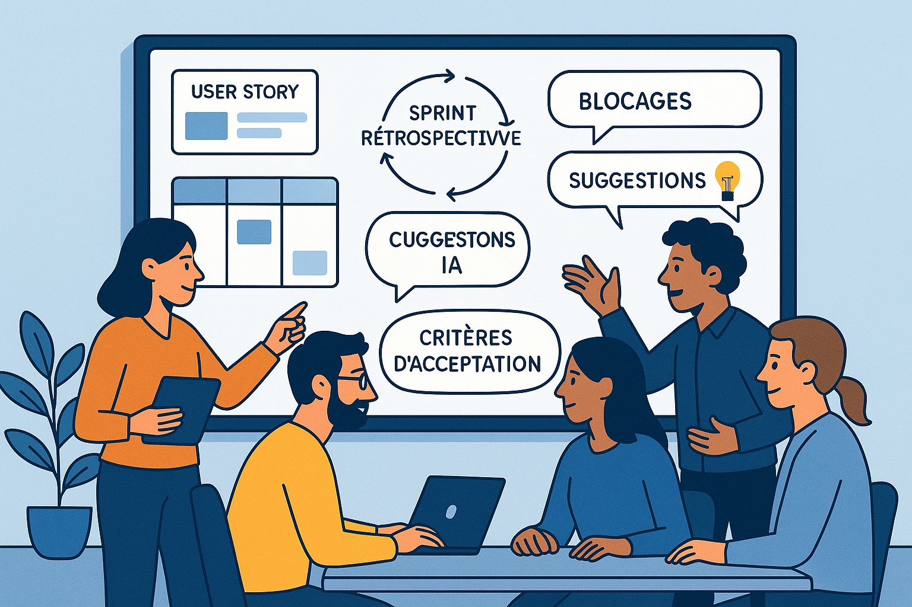

---

## 🌀 Chapitre 8 — Une agilité augmentée ?

> Et si le LLM devenait un nouveau type de membre de l’équipe ?
> Non pas un développeur automatisé, mais un **stimulateur de conversation**, un **accélérateur de réflexion**, un **miroir de posture**.

---

### 🧭 Pourquoi ce chapitre ?

L’agilité, dans son essence, repose sur des cycles courts, une adaptation constante, une collaboration étroite. Les LLM peuvent sembler, à première vue, extérieurs à cette culture humaine et incrémentale.

Et pourtant… bien utilisés, ils peuvent **accélérer certains flux**, enrichir la réflexion collective, ou faciliter l’appropriation de pratiques.

Ce chapitre explore **comment l’agilité peut être augmentée par les LLM**, sans perdre son âme.

---

### 🔁 Les principes agiles, revisités par l’IA

| Principe agile                   | Ce que le LLM permet (ou interroge)                                          |
| -------------------------------- | ---------------------------------------------------------------------------- |
| Collaboration constante          | Simuler des points de vue, prototyper des idées, challenger un choix         |
| Réponse au changement            | Réviser rapidement des specs ou du code en réponse à une nouvelle contrainte |
| Simplicité                       | Reformuler une solution complexe pour en extraire l’essence                  |
| Feedback rapide                  | Générer des tests, comparer des variantes, explorer des alternatives         |
| Travail en équipe auto-organisée | Outiller la prise de décision, formaliser les idées émergentes               |

> Le LLM ne remplace pas l’équipe. Il **outille sa réflexivité**.

---

### 🔧 Rituel par rituel : que change le LLM ?

#### L’IA comme pair silencieux dans la planification

Durant les *sprint plannings*, un LLM peut être utilisé pour clarifier des user stories, en générer des variantes, ou estimer des scénarios alternatifs. Par exemple, une équipe produit peut demander :

> *“Quels cas limites devrions-nous prendre en compte pour cette user story ?”*

ou encore :

> *“Peux-tu proposer trois façons différentes d’implémenter cette fonctionnalité avec leurs avantages/inconvénients ?”*

Le modèle ne prend pas la décision, mais il élargit l’espace de réflexion.

#### Écriture de tests et de critères d’acceptation

L’un des usages les plus directs en agilité est la génération (ou la vérification) de **tests automatisés** ou de **critères d’acceptation** à partir d’une user story. Cela aligne naturellement les équipes sur le *“definition of done”*, tout en réduisant les oublis.

> *User story : En tant qu’utilisateur connecté, je veux recevoir une notification quand un nouveau message arrive.*
> → *Critères d’acceptation générés :*
>
> * L’utilisateur est connecté.
> * Un message est reçu.
> * Une notification apparaît dans les 3 secondes.
> * L’utilisateur peut cliquer sur la notification pour ouvrir le message.

#### Daily meetings augmentés

Sans remplacer les échanges humains, un LLM peut aider à synthétiser les points clés discutés la veille, ou à générer un résumé quotidien des tickets en cours, des blocages identifiés, ou des dépendances critiques. Intégré dans un outil comme Jira ou GitHub, cela libère du temps pour des échanges plus qualitatifs pendant les dailies.

> **Exemple** : une équipe a connecté un LLM à son tableau Kanban. Chaque matin, un résumé automatisé des mouvements sur le board était proposé. Cela a permis de gagner en réactivité sur les points bloquants.

> **Actions rapides**
> * Reformuler les blocages en prompt pour les rendre actionnables
> * Générer rapidement des solutions de contournement
> * Partager les prompts utilisés la veille comme “retex instantané”
> 
>> *“Hier j’ai utilisé un miroir d’implémentation pour débloquer ma PR.”*

#### L’IA comme miroir en rétrospective

L’un des usages émergents les plus intéressants est celui de **l’analyse réflexive assistée**. En analysant les logs de tickets, les commentaires de code ou les transcriptions de réunion, un LLM peut détecter des motifs récurrents de tension, de délai, ou de manque de clarté.

> *“Sur les trois derniers sprints, quelles user stories ont nécessité plus de deux itérations de test ?”*
> *“Peux-tu repérer des points communs entre les bugs signalés en production ?”*

Cela n’exclut pas l’intelligence collective humaine, mais permet de **poser de meilleures questions** lors des rétrospectives.

---

#### Bonnes pratiques pour une intégration saine

* **Co-construire les usages** : l’équipe doit décider collectivement quand et comment utiliser les LLM.
* **Maintenir la transparence** : documenter les échanges avec le modèle, archiver les prompts clés.
* **Conserver le contrôle humain** : l’IA propose, mais l’équipe décide.
* **Favoriser l’apprentissage mutuel** : une veille régulière sur les usages IA en équipe peut créer une culture de progression continue.
* **Identifier les biais** : toujours valider les suggestions du LLM, notamment sur les choix d’architecture, de sécurité ou de performance.

> **« L’IA est-elle un membre de l’équipe ? »**
>
>C’est une question qui revient souvent. Un LLM peut-il être considéré comme un *membre virtuel* de l’équipe ? Pour certains, cela aide à le personnifier et à structurer les interactions (ex. : "notre assistant d’équipe"). Pour d’autres, cela dilue la responsabilité collective. Une position intermédiaire consiste à le voir comme **un outil de facilitation intelligente**, à la fois accessible à tous et gouverné par des règles d’usage partagées.

### 🚩 Risques et vigilance

| Risque                       | Explication / Exemples                                                 |
| ---------------------------- | ---------------------------------------------------------------------- |
| **Surcharge cognitive**      | Trop de prompts, trop de suggestions à trier                           |
| **Effet tunnel génératif**   | Suivre une suggestion IA sans la remettre en question                  |
| **Illusion de vélocité**     | Générer vite ≠ avancer mieux                                           |
| **Biais dans les décisions** | Le modèle propose une “moyenne” sans tenir compte du contexte réel     |
| **Automatisation aveugle**   | Remplacer les conversations humaines par des réponses IA non discutées |

> L’agilité est une culture du feedback. Le LLM ne doit **jamais supprimer la boucle humaine**.

---

### ✏️ En résumé

* L’agilité n’a pas besoin d’être remplacée. Elle peut être **augmentée** par un usage réfléchi des LLM.
* Les **rituels deviennent des lieux d’activation des motifs**.
* Le LLM devient un **outil de facilitation, pas un automate de production**.
* Cela suppose une **vigilance collective**, un cadre d’usage, et un langage partagé.

    

> Un LLM bien utilisé rend l’équipe plus autonome, plus réflexive, plus alignée.
> Mal utilisé, il peut **court-circuiter les fondamentaux** de l’agilité.
