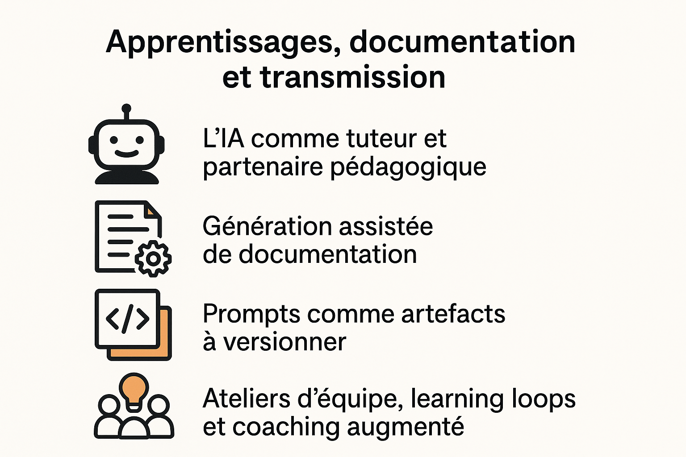

---

## 🧱 Chapitre 10 — Transmettre, former, partager les motifs

 Un motif, par nature, est fait pour être partagé.
> Ce n’est pas une astuce individuelle, mais un **savoir incarné, transmis, enrichi en contexte.**

---

### 🎯 Pourquoi ce chapitre ?

Un langage de motifs ne vaut que s’il est :

* **pratiqué**,
* **questionné**,
* **intégré**,
* **transmis**.

Ce chapitre répond à une question clé : **comment faire vivre les motifs dans votre organisation, votre communauté ou votre écosystème de pratique ?**

    

---

### 🧑‍🏫 Formation initiale : apprendre par la pratique

#### 🧪 1. Ateliers d’initiation

| Atelier                           | Objectif                                   | Durée  | Format                   |
|-----------------------------------|--------------------------------------------|--------|--------------------------|
| **Prompt Dojo**                   | Créer un prompt, l’itérer, le tester       | 1h     | Binômes / petits groupes |
| **Exploration par motifs**        | Résoudre un problème en utilisant un motif | 1h30   | Cas d’usage réel         |
| **Décryptage de conversation IA** | Analyser une interaction générée           | 45 min | Exercice en miroir       |

> Chaque atelier est centré sur un ou deux **gestes conversationnels**. Il vise l’appropriation, pas l’exhaustivité.

---

### 🤝 Transmission continue : faire vivre les motifs dans l’équipe

#### 📚 2. Partage de motifs vécus

Exemples de pratiques :

* Réserver 10 min en rétrospective pour “le motif du sprint”.
* Tenir un **journal d’équipe** des interactions LLM remarquables.
* Ajouter un champ “motif utilisé” dans les PR.

> Un motif partagé devient un **point d’appui pour aligner les pratiques**.

---

#### 🧩 3. Création de motifs d’équipe

Une équipe peut créer ses propres motifs :

1. Choisir une situation fréquente (ex. : "refactorisation après bug").
2. Identifier ce qui fonctionne avec le LLM.
3. Nommer le motif, lui donner une forme.
4. Le documenter (fiche-outil, retex, capture).

> Cette démarche crée une culture réflexive et transmissible.

---

#### 💬 4. Témoignage augmenté : le retex conversationnel

Lors d’un atelier métier, un membre présente une interaction LLM réussie (ou non) :

* Objectif du prompt
* Résultat obtenu
* Ce qui a aidé ou bloqué
* Motif utilisé ou émergent

Ce format court (10–15 min) favorise la **démocratisation du langage de motifs**, sans expertise préalable.

---

### 🌍 Partage élargi : au-delà de l’équipe

* Dans une communauté interne (guilde tech, slack d’entreprise) : canal `#prompt-examples`
* Dans une communauté ouverte (dev.to, conférences, forums) : billet “3 motifs qui m’aident au quotidien”
* Dans une formation : intégrer les motifs comme “piliers de posture”

---

### 🧠 Une posture à transmettre

> Transmettre un motif, ce n’est pas donner une solution.
> C’est inviter à l’expérimentation, à l’ajustement, à la création de sens.

Le langage de motifs est vivant. Il appelle à :

* la **curiosité** (oser tester),
* la **lucidité** (savoir ce qui ne marche pas),
* la **générosité** (partager ses trouvailles, ses ratés, ses doutes).

---

### ✏️ En résumé

* Les motifs sont des outils d’apprentissage **par et pour la pratique**.
* Leur transmission passe par **des formats simples, incarnés, reproductibles**.
* Créer une culture de partage autour des motifs, c’est **ancrer durablement les bons usages des LLM**.

> Une organisation qui apprend à partager ses motifs devient **une organisation réflexive, augmentée, résiliente.**
