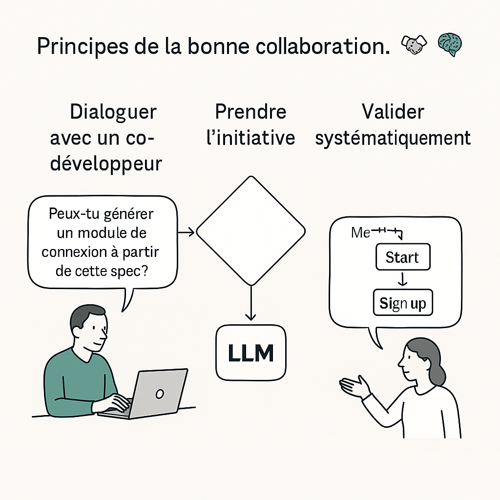

---

## 🧠 Chapitre 2 — La grammaire de l’intention : penser et formuler avec un LLM

> Un LLM ne comprend pas. Il complète. Il n'infère pas un raisonnement vrai, mais une suite plausible. C’est à nous, humains, d’en faire un partenaire valable — en cadrant l’échange, en le structurant, en l’habitant.

Concevoir avec un LLM, ce n’est pas lui donner des ordres. C’est construire un dialogue. Et comme tout dialogue, il a ses règles implicites, ses codes, ses zones de friction.

Dans ce chapitre, nous proposons une **grammaire de l’interaction** : un ensemble de gestes, de réflexes, de postures qui rendent le dialogue avec un LLM productif. Ce n’est pas une syntaxe à apprendre par cœur, mais une façon de penser : **penser en interaction**.

---

### 🎼 Le LLM comme partenaire naïf

Imaginez une séance de conception avec un collègue ultra-compétent mais :

* qui ignore votre contexte exact,
* qui a une mémoire partielle de l’échange,
* qui répond parfois avec brio, parfois à côté,
* et qui n’ose jamais dire « je ne sais pas ».

C’est cela, travailler avec un LLM. Il faut donc créer les conditions d’un échange utile : structurer, contextualiser, itérer.

> Le LLM connaît tout, mais ne sait rien de vous.
> Il est rapide, mais oublie.
> Il est créatif, mais naïf.
> Il n’est pas fiable par défaut — il le devient par collaboration.

---

### 🎯 Les 5 gestes fondamentaux de la grammaire d’intention

#### 1. **Cadrer (toujours recontextualiser)**

Un LLM ne possède ni mémoire longue ni connaissance de votre projet. Vous devez réinjecter le **contexte fonctionnel, technique, métier** dans chaque interaction.

> *« Je travaille sur une application bancaire en Java, mon objectif est de sécuriser les appels à l’API de transaction. »*

#### 2. **Questionner (une chose à la fois)**

Le LLM fonctionne mieux avec des demandes unitaires. Une seule intention par prompt. Si vous lui posez trois questions, il répondra à celle qu’il comprend le mieux… pas forcément la plus importante.

> ✅ *« Peux-tu décomposer cette tâche en étapes techniques ? »*
> ❌ *« Donne-moi du code + une doc + les cas limites. »*

#### 3. **Reformuler (valider et clarifier)**

À chaque réponse du modèle, interrogez la cohérence. Reformulez ce que vous avez compris. Provoquez des justifications. Cela crée un dialogue itératif.

> *« Si je comprends bien, tu proposes une architecture orientée services. Quels sont les points faibles de cette approche selon toi ? »*

#### 4. **Synthétiser (consolider les décisions)**

Le LLM n’a pas de continuité implicite. Il ne garde pas en tête ce qui a été dit plus tôt, sauf si vous le reformulez. Résumez les décisions, les hypothèses, les orientations prises à chaque étape importante.

> *« Résumons les contraintes du système que nous avons posées : performance, tolérance aux pannes, faible coût. Peux-tu revalider les choix d’architecture à l’aune de ces critères ? »*

#### 5. **Tester (mettre à l’épreuve la réponse)**

Ne prenez pas la réponse du modèle pour une vérité. Demandez-lui d’envisager un contre-exemple, une limite, un cas extrême. Cela affine la solution… ou révèle ses failles.

> *« Dans quel cas cette solution pourrait échouer ? »*
> *« Et si le graphe contient des cycles négatifs ? »*

---

### 🔎 Cas d’usage : reformuler pour penser mieux

Une équipe travaille sur un module de gestion de stock. Elle utilise un LLM pour choisir entre une architecture monolithique et des microservices. Le prompt initial — *« Quelle architecture choisir ? »* — génère une réponse générique.

En injectant des contraintes spécifiques (taille de l’équipe, fréquence des déploiements, besoins d’évolutivité horizontale), la réponse s’affine. Le LLM devient alors un **simulateur d’options**, et le dialogue une façon d'explorer des possibles.

---

### 🛠 Grammaire active — exemple d’atelier

Une autre équipe utilise un LLM comme **facilitateur d’idéation** lors d’un atelier. Chaque participant pose une question au modèle. La réponse est discutée collectivement, puis reformulée. Certains prompts deviennent des objets de travail communs. D'autres sont affinés en groupe. L’IA n’a pas remplacé la discussion : elle l’a catalysée.

---

### 🧭 Synthèse : les 5 réflexes d’une bonne interaction

| Geste         | Question associée                        |
| -------------- | ---------------------------------------- |
| **Cadrer**     | Dans quel contexte suis-je ?             |
| **Questionner** | Est-ce que je pose une seule question claire ? |
| **Reformuler** | Est-ce que je vérifie ce que le modèle a compris ? |
| **Synthétiser** | Est-ce que je stabilise ce qui a été décidé ? |
| **Tester**     | Quelles limites n’ont pas été explorées ? |

    

---

> La grammaire de l’intention n’est pas une méthode figée. C’est un art d’interagir, d’ajuster, de construire du sens dans la nuance.

Comprendre cette grammaire, c’est poser les fondations d’un dialogue efficace. C’est apprendre à ne pas déléguer le raisonnement, mais à le distribuer. C’est, en somme, faire du LLM un **copilote intelligent**, et non un oracle à suivre aveuglément.
