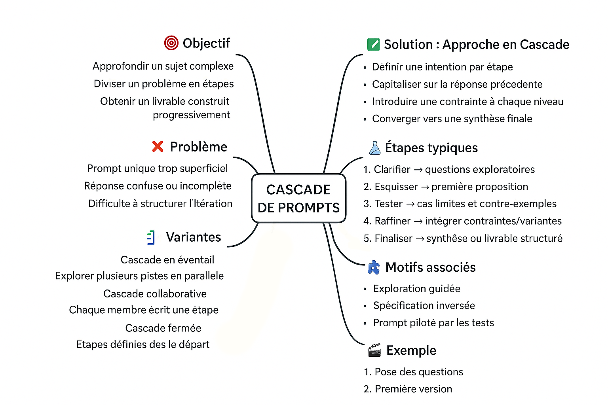

---

### 🟣 Motif 9 — **Cascade de prompts** : *Chapelet conversationnel*

    

**🎯 Contexte**

Vous devez traiter un problème complexe, flou ou trop vaste pour être résolu en un seul prompt.  
Vous souhaitez structurer une démarche itérative, étape par étape, en construisant chaque interaction sur la base de la précédente.

**🚧 Problème**

Un prompt unique produit souvent une réponse :

* trop généraliste ou superficielle,  
* difficile à approfondir sans tout reprendre,  
* mal structurée pour l’action.

Il est difficile de guider le LLM de manière progressive sans perdre le fil.

**✅ Solution**

Adoptez une **démarche en cascade** :  
enchaînez plusieurs prompts ciblés, chaque réponse servant de **base à la suivante**, comme un cheminement guidé.

Vous devenez le **chef d’orchestre de la progression**, en posant à chaque étape :

1. une intention claire,  
2. une contrainte ou critère supplémentaire,  
3. une demande de synthèse ou de variation.

**📌 Conséquences**

* Réduction de la charge cognitive par étape  
* Meilleure maîtrise du contexte (vous contrôlez ce qui est conservé ou précisé)  
* Permet d’arriver à des livrables robustes et clarifiés  
* Favorise la co-construction et l’appropriation progressive

**💡 Exemple d’usage**

🎯 Objectif : générer une spécification fonctionnelle claire pour une nouvelle API

> *Exploration du besoin* :   
> « Peux-tu me poser 5 questions pour clarifier une API de gestion d’utilisateurs ? »

> *Structuration des réponses* :   
> « Voici mes réponses. Propose un premier draft de l’API avec endpoints et méthodes. »

> *Critères de robustesse*  
> « Quels sont les cas limites oubliés dans cette version ? »

> *Spécification enrichie*  
> « Réécris la spécification en incluant la gestion des rôles et des permissions. »

**🌀 Variantes utiles**

* **Cascade en éventail** : vous explorez plusieurs chemins parallèles en parallèle, puis fusionnez ou choisissez.  
* **Cascade collaborative** : chaque membre d’une équipe écrit ou relance une étape (ex. design dialogué).  
* **Cascade fermée** : vous définissez dès le départ les 3 ou 4 étapes du chemin à parcourir.

**🧠 Motifs connexes**

* *Exploration guidée* (découper la pensée)  
* *Spécification inversée* (à utiliser au début ou au milieu d’une cascade)  
* *Prompt piloté par les tests* (fin de cascade)
