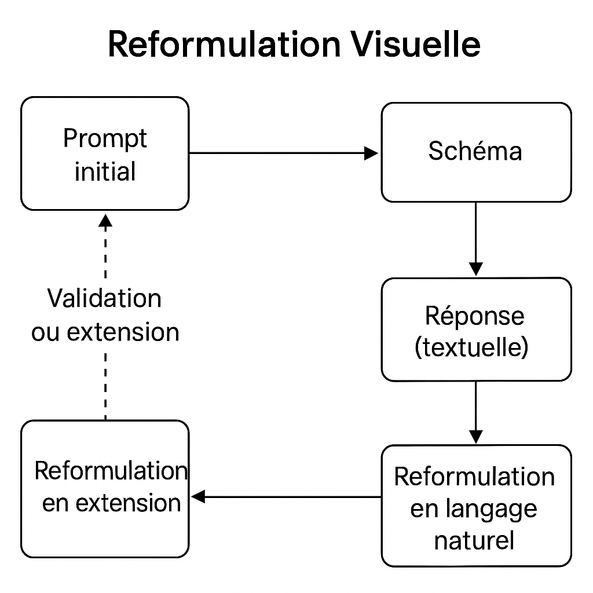

---

### 🟣 Motif 7 — **Reformulation visuelle** : *Clarifier par la représentation*

    

**🎯 Contexte**
Le LLM propose une solution textuelle : une architecture, un algorithme, un processus, une organisation de code. La réponse est intéressante, mais dense ou ambiguë. Vous soupçonnez qu’il manque des liens, que des parties sont floues ou que des incohérences se cachent dans la linéarité du texte.

**🚧 Problème**
Le langage naturel masque parfois les **zones d’ombre** : raccourcis logiques, interfaces mal définies, modules manquants, étapes implicites… La solution semble complète mais elle **n’est pas vérifiée structurellement**. Sans visualisation, on risque une adhésion naïve ou une implémentation bancale.

**✅ Solution**
Transformer la proposition textuelle du LLM en **schéma visuel** : diagramme de composants, flux, tableau structuré, carte mentale, etc. Puis **reformuler ce schéma en langage naturel**, et le soumettre à nouveau au modèle pour validation, critique ou enrichissement.

> Exemple de boucle :
>
> 1. Demande initiale → réponse textuelle du LLM
> 2. Visualisation manuelle (draw\.io, tableau, carte mentale…)
> 3. Reformulation textuelle structurée de ce que vous avez compris
> 4. Nouveau prompt au LLM : « Voici ma compréhension. Est-ce cohérent ? Que manque-t-il ? »

**📌 Conséquences**

* Fait émerger les **incohérences logiques** plus tôt.
* Facilite la validation collective dans l’équipe.
* Favorise une meilleure **appropriation humaine** de la solution.
* Stimule un échange réflexif entre humain et IA.
* Développe une compétence clé : **modéliser pour comprendre**.

**💡 Exemple d’usage**
Le LLM propose une architecture pour un système de notifications multicanal. Un développeur la transforme en diagramme de composants :

* gestionnaire d’alerte,
* module de priorisation,
* file d’attente,
* envois webhook/email,
* Redis pour le cache.

Il reformule :

> *« Si j’ai bien compris, l’alerte arrive dans un gestionnaire, qui la classe, la stocke, puis la transmet. Redis sert de cache. Est-ce juste ? Que faudrait-il ajouter ? »*

Le LLM répond :

> *« Il manque un mécanisme de gestion des échecs d’envoi. Vous pourriez ajouter une file de retry avec journalisation. »*

Cette boucle de reformulation **renforce la robustesse** de la solution.

**🌀 Variantes utiles**

* **Tableau à double entrée** : rôles × responsabilités, modules × dépendances.
* **UML léger** : diagramme de classes, de séquence, d’activités.
* **Carte mentale** : utile pour explorer des fonctionnalités ou des flux.
* **Schéma manuscrit + transcription** : dessiner sur papier, puis demander au LLM de l’exprimer en mots.

**🛠️ Outils associés**

* Outils de modélisation (draw\.io, Whimsical, Excalidraw…).
* Schéma intégré dans les prompts suivants : *« Voici un schéma, décris-le comme si tu l’avais proposé. »*
* Rituels d’équipe : validation d’architecture augmentée par schématisation + IA.

**🧠 Posture recommandée**
Ne restez pas dans le flou textuel. Passez par la **visualisation pour clarifier, valider, enrichir**. Le dessin ou la structure posée est une **forme de dialogue** en soi — avec soi-même, avec les autres, avec le modèle.

**💬 Prompt-type à mémoriser**

> *« Voici une reformulation textuelle de mon schéma. Peux-tu vérifier si elle est cohérente avec ta proposition initiale, et proposer des améliorations ? »*
