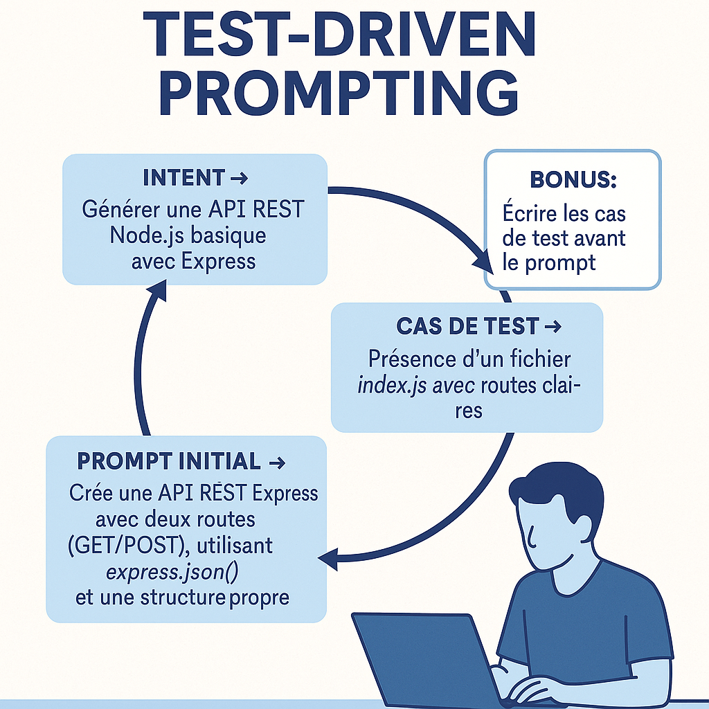

---

### 🟣 Motif 6 — **Prompt piloté par les tests** *TDP* : *Définir les attentes avant d’écrire*

**🎯 Contexte**
Vous voulez concevoir un prompt que vous pourrez réutiliser, partager ou intégrer dans un outil. Mais les résultats du LLM sont trop variables, parfois hors sujet, parfois très bons… sans que vous compreniez pourquoi. Il devient difficile de stabiliser l’usage.

**🚧 Problème**
Le prompt est écrit à l’intuition, sans cadre clair. Les attentes ne sont pas explicitées. Résultat : le modèle improvise, et ses réponses sont **inconsistantes**. Vous corrigez a posteriori, au lieu de piloter la production en amont.

**✅ Solution**
Adopter une démarche inspirée du **Test-Driven Development** (TDD) :
avant de rédiger le prompt, **définir les attentes** que la réponse doit satisfaire. Cela peut inclure :

* des exemples concrets de sortie attendue (mock output),
* des critères de structure, de style ou de contenu,
* des contraintes explicites de format, de ton, de longueur.

Ensuite, **écrire le prompt pour qu’il satisfasse ces critères**. Puis le tester. Puis l’affiner. Vous concevez le prompt **comme une unité fonctionnelle à valider**.

> Exemples de critères préalables :
>
> * « La réponse doit tenir en moins de 3 phrases. »
> * « Utiliser un ton empathique mais professionnel. »
> * « Ne jamais mentionner d’excuses juridiques. »
> * « Commencer par une reformulation de la demande client. »

**📌 Conséquences**

* Vos prompts deviennent **précis, stables et réutilisables**.
* Vous gagnez du temps à long terme.
* Vous pouvez partager des prompts testés dans une équipe ou un outil.
* Vous transformez le prompt en **artefact d’ingénierie** à part entière.
* Vous détectez les limites de ce que le LLM peut ou ne peut pas bien faire.

**💡 Exemple d’usage**
Une équipe crée un assistant conversationnel pour répondre à des tickets clients.
Prompt initial :

> *« Rédige une réponse empathique au client. »*

Résultat : trop long, trop vague, parfois juridiquement risqué.
Ils décident de poser ces attentes **avant** :

* 2 à 3 phrases max,
* Pas d'excuses juridiques,
* Rassurer sans promettre,
* Adapter le niveau de langage au client identifié.

Ils ajustent ensuite le prompt jusqu’à ce qu’il **produise des réponses qui passent ces tests**. Le prompt est ensuite versionné, partagé, intégré dans un outil.

**🌀 Variantes utiles**

* **TDP visuel** : créer un exemple de sortie attendue, et demander au modèle de « coller à cet exemple ».
* **TDP collaboratif** : faire définir les attentes par plusieurs rôles (PO, UX, support, tech).
* **TDP embarqué** : inclure les critères de test *dans le prompt lui-même* :

  > *« La réponse doit tenir en 3 phrases max, rester neutre, et finir par une question ouverte. »*

**🛠️ Outils associés**

* Librairie de prompts versionnés (Markdown ou Notion).
* Fichiers de test (exemples de prompts + sorties attendues).
* Evaluation semi-automatisée de réponses (score sur critères définis).

**🧠 Posture recommandée**
Concevez vos prompts **comme du code** : testables, maintenables, évolutifs. Ne vous contentez pas d’un prompt qui « marche une fois » : visez la robustesse. Cela rend vos pratiques plus pro, plus partageables, plus fiables.

**💬 Prompt-type à mémoriser**

> *« Voici un exemple de réponse attendue. Peux-tu formuler un prompt qui produise ce type de sortie de façon cohérente ? »*

    

