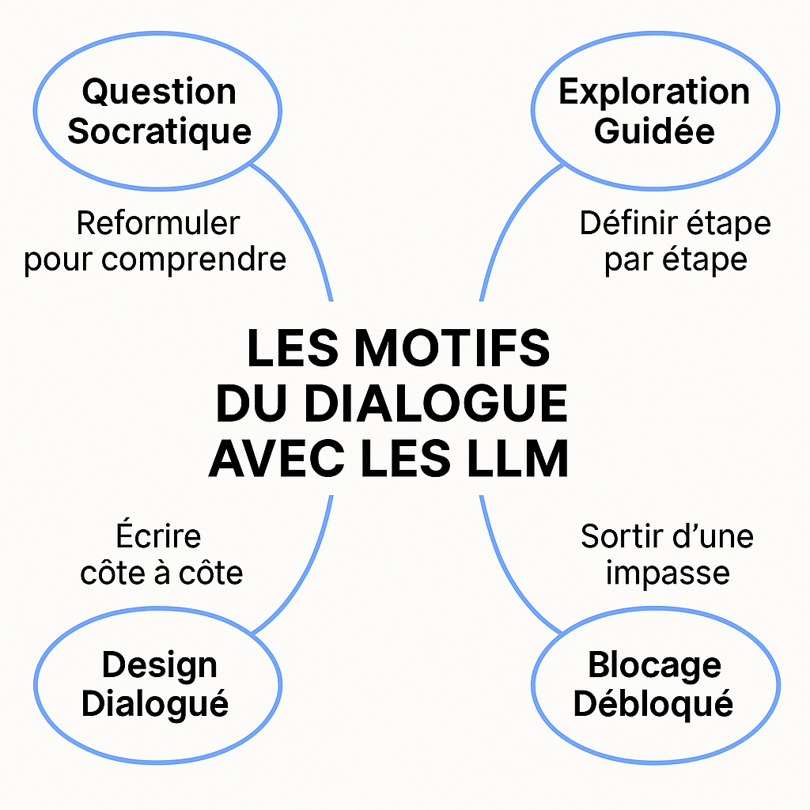

---

## 🧰 Chapitre 3 — Les motifs du dialogue : construire un langage de conception avec les LLM

> Concevoir avec un LLM, c’est plus qu’écrire des prompts. C’est pratiquer un art du dialogue. Ce chapitre propose une bibliothèque de **motifs conversationnels** — des séquences typiques d’interaction, issues du terrain, à la fois réutilisables et adaptables.

---

### Pourquoi un langage de motifs ?

Dans le développement logiciel, certaines situations reviennent sans cesse : formuler un besoin flou, explorer des options techniques, comprendre un code hérité, choisir une architecture. Avec un LLM, ces situations prennent une nouvelle forme — mais les **récurrences d’usage demeurent**.

> Un motif, c’est une **forme récurrente d’interaction efficace** dans un contexte donné. Il ne dicte pas quoi faire, mais propose un **cadre pour bien faire**.

---

## 🔧 Structure d’un motif

Chaque motif suit une structure claire :

* **Nom** : une expression mémorable
* **Contexte** : quand le motif s’active
* **Problème** : ce qui empêche le progrès
* **Solution** : la posture ou forme d’interaction recommandée
* **Conséquences** : ce que cela permet
* **Exemple** : cas réel ou inspiré du terrain
* **Variantes (facultatif)** : déclinaisons utiles
* **Outils associés (facultatif)** : IDE, plugin, canevas…

<div style="page-break-after: always;"></div>

---

## 📚 Bibliothèque de motifs

---

### 🔷 Motif 1 — *Question Socratique* : reformuler pour comprendre

**Contexte**
Un besoin est exprimé de manière floue ou partielle, ou vous entrez dans un domaine que vous maîtrisez peu.

**Problème**
Un prompt vague produit une réponse générique ou mal orientée.

**Solution**
Amorcer un **dialogue par questions progressives** pour clarifier l’intention, comme un facilitateur ou un coach :

> « Quels types d’erreurs souhaitez-vous capturer ? »
> « Quel canal de notification ? Quelle fréquence ? »

**Conséquences**

* Clarifie les besoins, même pour l’humain
* Enrichit le prompt au fil du dialogue
* Engage un raisonnement partagé

**Exemple**
Demander « Crée un script d’alerte » → réponse floue.
Poser 3 questions ciblées → réponse précise, intégrée au projet réel.

<p style="text-align: center;">
    
</p>

<div style="page-break-after: always;"></div>

---

### 🔷 Motif 2 — *Exploration guidée* : découper pour mieux avancer

**Contexte**
Vous devez explorer un domaine complexe ou inconnu.

**Problème**
Les réponses sont trop généralistes. Trop de pistes, pas de structure.

**Solution**
Demander au LLM de proposer **une décomposition en étapes**.

> « Quelles grandes étapes pour sécuriser une API REST ? »
> « Propose-moi un plan d’implémentation progressif. »

**Conséquences**

* Réduction de la charge cognitive
* Planification par itération
* Apprentissage ciblé sur chaque sous-partie

**Exemple**
Migration monolithe → microservices : demander les étapes, puis explorer chaque étape une à une.

---

> **Une session de pairing augmentée**
>
> Lors d’une séance de co-développement, deux développeurs travaillent ensemble à concevoir un module de traitement de factures. L’un d’eux propose d’interroger le LLM pour structurer le travail. Le prompt initial : *"Comment concevoir un module de traitement de factures dans un ERP ?"* produit une réponse dense mais confuse.
>
> L’un des développeurs reformule alors : *"Peux-tu me proposer une décomposition en étapes pour construire ce module, du point de vue fonctionnel et technique ?"*
>
> Le LLM répond :
>
> * Identifier les sources de données (factures fournisseurs, clients).
> * Définir les règles de validation.
> * Modéliser les statuts de traitement.
> * Intégrer les notifications.
> * Prévoir l’export comptable.
>
> À partir de cette réponse, les deux développeurs réorganisent leur backlog, définissent les premières user stories, et rédigent ensemble les spécifications du MVP. Le LLM a non seulement servi de facilitateur technique, mais aussi de médiateur de compréhension mutuelle, révélant des angles morts et clarifiant les priorités. L’exploration guidée a permis de sortir du flou initial pour entrer dans l’action concrète.

<div style="page-break-after: always;"></div>

---

### 🔷 Motif 3 — *Spécification inversée* : remonter aux intentions à partir du code

**Contexte**
Vous devez comprendre ou refactorer un code sans doc, sans contexte.

**Problème**
Le code précède la conception — impossible d’en déduire les intentions.

**Solution**
Demander au LLM de **reconstituer la logique métier, les hypothèses, ou les user stories** à partir du code.

> « Quelles règles métier vois-tu dans ce code ? »
> « Quelle user story ce bloc implémente-t-il ? »

**Conséquences**

* Documentation rétroactive
* Détection des biais ou trous logiques
* Meilleure maintenabilité

**Exemple**
Un script Python d’analyse réseau est soumis au LLM. Il reconstruit les intentions et génère les cas de test.

**Variantes**

* 3.1 : *Reconstruction d’User Story*
* 3.2 : *Déduction des hypothèses implicites*
* 3.3 : *Contrat d’interface implicite*

---

> **Un LLM comme auditeur de code**
>
> Lors d’un audit technique sur un système de facturation, une équipe se retrouve face à un module PHP de plus de 800 lignes, écrit il y a 8 ans, sans tests ni documentation. Plutôt que de l'analyser ligne par ligne, l’équipe décide de le soumettre au LLM par blocs successifs.
>
> À chaque itération, le prompt est : *"Quels traitements réalise ce bloc de code ? Quelle règle métier cela semble-t-il implémenter ?"*
>
> Le LLM identifie la détection de doublons, la vérification de TVA, la gestion d’arrondis, et les cas particuliers de facturation croisée. Ces éléments sont mis en parallèle avec les processus métier décrits dans la documentation client, révélant plusieurs écarts non documentés.
>
> Cette approche de spécification inversée a permis de :
>
> * Documenter rétroactivement un système critique,
> * Réconcilier la logique métier et l’implémentation réelle,
> * Planifier une refonte progressive sans repartir de zéro.

<div style="page-break-after: always;"></div>

---

### 🌀 Variantes du motif « Spécification Inversée »

#### 📌 Variante 3.1 : *Reconstruction d’User Stories*

Au lieu de demander uniquement *ce que fait le code*, on pousse le LLM à reformuler les intentions en *termes fonctionnels utilisateur*. Exemple de prompt :

> *« En supposant que ce code corresponde à une fonctionnalité d’un produit, quelle user story pourrait-on en déduire ? »*

**Usage** : utile dans des projets où le code a été produit avant la formalisation des besoins (souvent le cas dans des prototypes ou des phases de hackathon).

#### 📌 Variante 3.2 : *Déduction des Hypothèses*

Demandez au LLM :

> *« Quelles hypothèses implicites ce code semble-t-il faire sur les données, les contextes d’exécution ou les droits d’accès ? »*

**Usage** : précieux pour détecter des biais implicites, des présupposés sur les inputs, ou des angles morts en sécurité.

#### 📌 Variante 3.3 : *Contrat implicite*

Demandez :

> *« Peux-tu expliciter un contrat d’interface pour cette fonction / ce module (types d’entrées, sorties, erreurs gérées) ? »*

**Usage** : aide à produire des *Design by Contract* à posteriori, ou à documenter des API sans doc initiale.

---

### 🛠 Mises en pratique concrètes

#### ✅ Pratique 1 : Générer les tests à partir de l’implémentation

Prompt-type :

> *« Génère une suite de tests unitaires couvrant les cas normaux, limites et erreurs de cette fonction. »*

**Résultat** : Le LLM suggère souvent des cas non couverts dans le code, révélant des lacunes potentielles.

---

#### ✅ Pratique 2 : Écrire la documentation avant refactorisation

Demande :

> *« Rédige une documentation technique synthétique (fonction, paramètres, exceptions, effets secondaires) à partir de ce code. »*

**Usage** : crée un point d’ancrage avant transformation, utile pour la relecture et le pair programming.

---

#### ✅ Pratique 3 : Détecter les effets de bord

Prompt :

> *« Est-ce que ce code a des effets secondaires non visibles immédiatement (ex. : écritures sur disque, accès à des variables globales, dépendances réseau) ? »*

**Usage** : audit de code legacy ou critique, base pour migration vers du code pur / testable.

---

### 🔄 Intégration dans un workflow d’équipe

Voici une **routine de revue de code assistée** utilisant ce motif :

1. 🔍 *Sélectionner une fonction critique à revoir.*
2. 🧠 *Demander au LLM de reformuler son intention métier.*
3. ✅ *Générer les tests que cette fonction est supposée passer.*
4. 🔄 *Comparer avec les tests existants.*
5. ✏️ *Documenter ou enrichir à la volée.*
6. 🛠 *Décider d’un refactor ou non.*

> 🔧 **Outil compagnon possible** : Un plugin ou script intégré dans l’IDE qui, à la sélection d’une fonction, envoie automatiquement un prompt de spécification inversée au LLM et affiche les hypothèses métier dans une fenêtre latérale.

---

### 🧭 Posture recommandée

* Ne pas se contenter de *ce que le LLM dit*, mais comparer avec les hypothèses de l’équipe.
* Utiliser les réponses comme **base de discussion**, notamment avec les parties prenantes non techniques.
* Croiser les approches : spécification inversée → exploration guidée → design dialogué.

<div style="page-break-after: always;"></div>

---

### 🔷 Motif 4 — *Modèle Miroir* : comparer pour éclairer un choix

**Contexte**
Vous hésitez entre plusieurs implémentations possibles (par exemple, deux structures d’API, deux algorithmes, deux stratégies d’architecture), ou vous avez généré plusieurs variantes avec le LLM et souhaitez les évaluer de façon argumentée.

**Problème**
Lorsqu’on explore des options seul ou en équipe, il est facile de se focaliser sur une solution "plausible" sans bien comprendre les différences, les conséquences ou les alternatives. Le LLM, sans guidance, tend à générer une seule réponse par défaut.

**Solution**
Exploitez le LLM comme un **miroir comparatif**. Demandez-lui explicitement de produire *plusieurs* versions d’une même solution, puis de **les comparer lui-même selon des critères définis**. C’est une mise en tension productive entre options, qui stimule l’analyse critique.

> « Propose trois structures possibles pour ce composant. Compare-les sur lisibilité, performance et maintenabilité. »

**Conséquences**

* Analyse dialectique
* Explicitation des critères de choix
* Réduction du biais de confirmation

---

### 🧪 Exemple concret

Lors d’un projet de refonte de système de paiement, l’équipe hésite entre :

1. Une architecture orientée événements avec Kafka.
2. Une architecture RESTful classique avec appels synchrones.

Le LLM est sollicité via ce prompt :

> *« Voici deux options d’architecture. Peux-tu détailler les avantages, risques et implications de chacune pour un système à haute disponibilité devant traiter 100 transactions par seconde ? »*

Le modèle identifie que :

* Kafka apporte résilience et découplage, mais complexifie la supervision.
* REST est plus simple à auditer mais moins robuste en cas de pics de charge ou d’erreurs réseau.

Cette analyse partagée permet à l’équipe de trancher plus sereinement, *en conscience*.

---

> 🧭 **Le LLM comme miroir d’équipe**
>
> Dans une réunion de design technique, une équipe ne parvient pas à se mettre d’accord entre deux styles de validation de formulaire côté frontend : impératif (en JS pur) ou déclaratif (via une lib type Formik ou React Hook Form).
>
> Un développeur propose de demander au LLM une comparaison structurée.
>
> Le prompt devient : *« Compare les styles impératif et déclaratif de validation de formulaire côté React. Donne des exemples de code et compare sur maintenabilité, UX et facilité de test. »*
>
> Le LLM répond avec clarté, exemples à l’appui, révélant que le choix dépend du niveau de complexité métier attendu et de l’organisation du code. Cela permet à l’équipe de ne pas trancher "par opinion", mais sur des critères explicites.
>
> Le modèle a servi ici de **facilitateur de clarification technique collective**, sans remplacer la décision humaine.

---

### 🔄 Variantes du motif « Modèle Miroir »

* **Miroir de styles** : comparer plusieurs styles de code pour une même logique (ex. fonctionnelle vs orientée objet).
* **Miroir de paradigmes** : comparer des approches (ex. polling vs event-driven).
* **Miroir de technologies** : comparer frameworks, langages, ou bibliothèques en fonction d’un usage ciblé.

<div style="page-break-after: always;"></div>

---

### Motif 5 : *Clarification par contre-exemple* : Explorer les limites d'une proposition

**Contexte** : Après avoir reçu une réponse satisfaisante d’un LLM, il arrive que des doutes subsistent : le code proposé est-il robuste ? La solution envisagée tient-elle dans tous les cas ? Les limites implicites du raisonnement sont-elles comprises ?

**Problème** : Un prompt initialement bien formulé peut conduire à une réponse correcte mais trop optimiste ou générique. Le LLM tend à « deviner » une solution type, sans toujours prendre en compte les cas limites, les exceptions ou les erreurs de conception possibles. Cela donne l’illusion de maîtrise, là où il faudrait de la rigueur.

**Solution** : Demander explicitement un contre-exemple ou une situation qui ferait échouer la solution proposée. Cette approche vise à forcer la mise en lumière de zones grises, d’angles morts ou de présupposés implicites. On peut formuler par exemple :

> « Quelle situation rend cette solution inefficace ? »
> « Et si les données sont mal formées ? »

Cette manière de questionner pousse le modèle (et le praticien) à réfléchir en creux, par la négation ou l’invalidation.

**Conséquences** :

* Renforce la robustesse de la solution en mettant à l’épreuve ses fondements.
* Favorise une posture critique et antifragile dans la conception.
* Transforme le LLM en simulateur d'obstacles potentiels, utile pour la revue de code ou la documentation des limites d’un système.

**Exemple** : Dans un atelier sur la génération d’algorithmes de parcours de graphe, un étudiant a demandé à ChatGPT de lui fournir une version optimisée de Dijkstra en JavaScript. Le code généré semblait parfaitement fonctionnel. En testant ensuite la robustesse du résultat via la question : "Et si le graphe est orienté avec des cycles négatifs ?", le LLM a admis que l’algorithme proposé ne convenait pas, et a suggéré de basculer sur Bellman-Ford avec un test d'intégrité des poids. Cette interaction a permis non seulement d’enseigner les limites d’un algorithme, mais aussi d’aiguiser l’esprit critique face à la "bonne réponse".

---

> 📌 **Posture réflexive : oser douter du bon élève**
>
> L’une des illusions les plus tenaces dans l’usage des LLM est celle de la "réponse parfaite" dès la première itération. Un motif comme "Clarification par contre-exemple" invite à adopter une posture scientifique : tester, falsifier, chercher ce qui ne va pas, même quand tout semble aller bien. Cela s’apparente à une relecture interne du raisonnement — une forme de revue de code dialoguée — où le développeur devient enquêteur des failles possibles. C’est aussi une manière de former les plus jeunes à ne pas confondre autorité de l’outil et vérité absolue.

<div style="page-break-after: always;"></div>

---

### 🔷 Motif 6 — *Prompt piloté par les tests* : définir les attentes avant d’écrire

**Contexte**
Vous créez un prompt pour un usage récurrent, mais les réponses sont fluctuantes.

**Problème**
Sans attentes explicites, le LLM improvise. Les résultats sont inconsistants.

**Solution**
Adoptez une démarche inspirée du Test-Driven Development : avant de rédiger le prompt, écrivez un ou plusieurs **tests d’intention** qui décrivent ce que vous attendez du LLM. Ce peuvent être :

* des exemples de sortie ;
* des critères formels (format, style, structure) ;
* des contraintes de contexte ou de contenu.

Utilisez ensuite ces tests pour guider l’écriture du prompt. Faites-le évoluer jusqu’à ce qu’il satisfasse les attentes définies.

**Conséquences**

* Vous gagnez en clarté sur ce que vous attendez vraiment du modèle.
* Vos prompts deviennent plus robustes, plus réutilisables et plus faciles à transmettre.
* Vous pouvez constituer une bibliothèque de prompts testés, versionnés et documentés.
* Le dialogue avec le LLM devient une activité d’ingénierie à part entière, structurée et maîtrisée.

**Exemple**
Une équipe travaillant sur un assistant de support client voulait générer automatiquement des réponses types à partir de tickets. Le prompt initial donnait des textes trop longs, trop formels et parfois hors sujet. En définissant des tests d’attente clairs — *"Réponse ≤ 3 phrases, ton empathique mais professionnel, ne jamais inclure d’excuses juridiques"*, etc. —, l’équipe a pu concevoir un prompt beaucoup plus précis. Celui-ci a été intégré dans leur base de connaissance, avec des versions pour différents registres de langue selon le client.

**Variations**

* **TDP visuel** : utilisez des "mock outputs" (sorties fictives attendues) comme référence.
* **TDP collaboratif** : faites définir les attentes par plusieurs membres de l’équipe (produit, technique, UX).
* **TDP dans le prompt** : incluez directement le test dans le prompt lui-même (ex. : *"Voici un exemple de réponse attendue..."*).

<p style="text-align: center;">
    
</p>

<div style="page-break-after: always;"></div>

---

## 🎯 Motif 7 — *Reformulation Visuelle* : clarifier par la représentation

**Contexte**

Vous utilisez un LLM pour concevoir un système, une fonctionnalité ou un processus. Le modèle vous fournit une solution textuelle relativement structurée (architecture, algorithme, flux d’information, découpage de responsabilités). Mais l'ambiguïté ou la complexité du texte rendent difficile une validation ou une mise en œuvre immédiate. Vous soupçonnez que des incohérences ou des zones d’ombre subsistent.

**Problème**

Le langage naturel (ou pseudo-code) peut masquer des raccourcis logiques, des oublis d’interfaces, des incompatibilités ou des malentendus. Les solutions proposées par le LLM semblent correctes, mais manquent parfois de précision dans la structure ou les interactions.

**Solution**

Transformez la réponse du LLM en **schéma explicite**, puis reformulez ce schéma en **langage naturel structuré**, que vous soumettez de nouveau au modèle. Ce processus permet de :

1. Détecter les zones ambiguës ou incohérentes,
2. Valider l’adéquation du modèle à l’intention initiale,
3. Enrichir ou compléter la proposition grâce au dialogue.

Le schéma peut être un diagramme de composants, de classes, de séquence, un cas d’usage, une carte mentale, ou un simple tableau structuré.

**Structure du dialogue**

```plaintext
1. Prompt initial → Réponse LLM (textuelle)
2. Schéma du développeur (hors modèle)
3. Reformulation du schéma en langage naturel
4. Prompt de validation ou d’extension au LLM
5. Réponse LLM (corrections, suggestions, alternatives)
```

**Conséquences**

* Permet de faire émerger des incohérences logiques plus tôt.
* Clarifie les échanges au sein de l’équipe (support visuel commun).
* Favorise l’appropriation de la solution par les humains.
* Renforce la capacité du LLM à produire des propositions robustes (en l’exposant à des feedbacks explicites).
* Développe des compétences de modélisation chez les développeurs.

**Exemple**

Dans un projet de refonte d’un système de notifications multi-canaux, le LLM propose une architecture textuelle décrivant un service de gestion d’alerte, un module de priorisation, une file d’attente et un mécanisme de diffusion. Un développeur modélise cette proposition dans un diagramme de composants avec draw\.io, puis reformule :

> "J’ai interprété ta proposition ainsi : les alertes arrivent dans un gestionnaire, qui les classe, les stocke si besoin, et les transmet par webhook ou email. Redis sert de cache entre les modules. Ce schéma est-il cohérent ? Y a-t-il des points à améliorer ?"

Le LLM identifie une faiblesse : l’absence de gestion des échecs d’envoi. Il propose un mécanisme de retry avec journalisation, enrichissant la solution.

**Variantes**

* Reformulation par **tableau à double entrée** (utile en cas de rôles et responsabilités).
* Utilisation d’**outils de modélisation UML**.
* Croisement avec des **cas d’usage rédigés** (user stories).
* Passage par **schéma manuscrit** + transcription.

**Anti-pattern**

Ne pas reformuler visuellement des propositions complexes peut conduire à :

* une adhésion aveugle à des solutions incomplètes,
* une surconfiance dans les capacités du LLM,
* des malentendus entre co-concepteurs humains.

<p style="text-align: center;">
    
</p>

<div style="page-break-after: always;"></div>

---

### 🔷 Motif 8 — *Soin systémique* : investiguer les causes profondes d’un problème

**Contexte**
Un comportement inattendu, un problème récurrent ou une tension d’équipe émerge sans cause évidente. La solution technique semble insuffisante ou incomplète. L’équipe cherche à comprendre "ce qui se joue vraiment" pour éviter de traiter seulement les symptômes.

**Problème**
Les LLM sont souvent utilisés pour résoudre un problème exprimé, sans remettre en question la formulation du problème lui-même. Cela peut conduire à des solutions locales, sans impact durable, ou à des réponses rapides qui contournent les vraies causes. L’intention initiale est rarement interrogée en profondeur.

**Solution**
Utiliser le LLM comme **partenaire d’investigation systémique**. Mobiliser un cadre comme le Neuf Pourquoi (Nine Whys) ou autre méthode d’analyse causale, en formulant des prompts qui explorent les hypothèses implicites, les causes possibles, les interactions systémiques. Demander ensuite au modèle de proposer **des pistes d’action ciblées** en lien avec les causes identifiées.

> 🧭 **Les Neuf Pourquoi : creuser le sens pour mieux agir**
>
> Inspiré des **Liberating Structures**, le canevas des *Nine Whys* propose un rituel simple, mais puissant : poser neuf fois de suite la question **« Pourquoi est-ce important pour toi ? »** à partir d’un sujet donné.
>
> Loin d’être un interrogatoire, c’est un **chemin de clarification progressive**, où chaque réponse devient la base de la question suivante. On ne cherche pas une cause unique, mais une **profondeur de sens** : ce qui motive vraiment l’action, ce qui fonde les choix, ce qui compte profondément.
>
> Dans le cadre du développement logiciel, cet outil devient précieux quand :
>
> * une décision semble évidente mais suscite du flou ou de la résistance,
> * un problème technique récurrent cache des tensions humaines ou systémiques,
> * une équipe veut aligner ses efforts sur ce qui a du sens.
>
> 👉 Le LLM peut ici jouer un rôle de **facilitateur de questionnement** : en proposant des formulations de relance, en structurant les réponses, ou en révélant des contradictions implicites.
>
> > Exemples de prompts :
> >
> > *« Peux-tu m’aider à simuler une session de Nine Whys sur ce problème : \[décrire la situation] ? »*
> > *« À chaque réponse, propose une reformulation de "Pourquoi est-ce important ?" en changeant légèrement l’angle (valeurs, impact, émotion, système…). »*
>
> En sollicitant un LLM avec ce cadre, on transforme une simple séance d’analyse en un **exercice de lucidité collective**, capable de reconnecter la technique au sens.

**Prompt-type**

> « Voici un problème récurrent dans notre équipe : \[décrire la situation]. Peux-tu m’aider à explorer les raisons profondes en utilisant la méthode des 5 ou 9 Pourquoi ? »
>
> « Pour chaque cause possible, quelles actions concrètes pourrions-nous envisager ? »
>
> « Quelles causes sont techniques, relationnelles, organisationnelles ? »

**Conséquences**

* Favorise une compréhension plus fine des tensions et blocages.
* Permet d’identifier des leviers d’action non évidents.
* Soutient une posture réflexive, systémique, non réactive.
* Offre un espace de délibération partagée avec l’IA comme catalyseur de recul.

**Exemple**
Une équipe constate une perte de motivation chez les développeurs autour d’un module complexe. Le LLM est d’abord interrogé sur comment "remotiver" — mais les réponses sont superficielles. Le Scrum Master reformule avec :

> *« Pourquoi cette démotivation selon toi ? Peux-tu explorer plusieurs causes possibles en t’appuyant sur les interactions humaines, les choix d’architecture, le rythme de livraison ? »*

Le modèle identifie alors :

* un manque de clarté dans les critères de qualité,
* une dette technique anxiogène,
* une absence de célébration des petits succès.

À partir de là, l’équipe définit plusieurs actions ciblées : des temps d’alignement sur les critères, des rituels de reconnaissance, un refactoring progressif. La cause systémique devient alors un levier d’action partagé.

**Variantes**

* **8.1 — Arbre des causes** : demander au LLM de générer un arbre logique des causes et sous-causes.
* **8.2 — Croisement de points de vue** : demander au modèle de formuler les causes vues par différents rôles (PO, dev, ops, client…).
* **8.3 — Hypothèses multiples** : inciter le modèle à produire des hypothèses contradictoires pour enrichir la réflexion.

---

## 🧭 En résumé : la carte des motifs

| Motif                       | Utilité principale                     |
|-----------------------------|----------------------------------------|
| **Question socratique**     | Clarification, cadrage                 |
| **Exploration guidée**      | Décomposition, apprentissage           |
| **Spécification inversée**  | Compréhension, documentation           |
| **Modèle miroir**           | Choix argumenté, design                |
| **Contre-exemple**          | Robustesse, critique                   |
| **Prompt piloté par les tests** | Prompt stable et reproductible         |
| **Reformulation visuelle**  | Langage commun, validation collective  |
| **Soin systémique**         | Analyse causale, investigation en profondeur |

---

> Chaque motif est une brique. Ensemble, ils forment un langage.
> Ce langage n’est pas figé — il est fait pour évoluer avec vous.

---