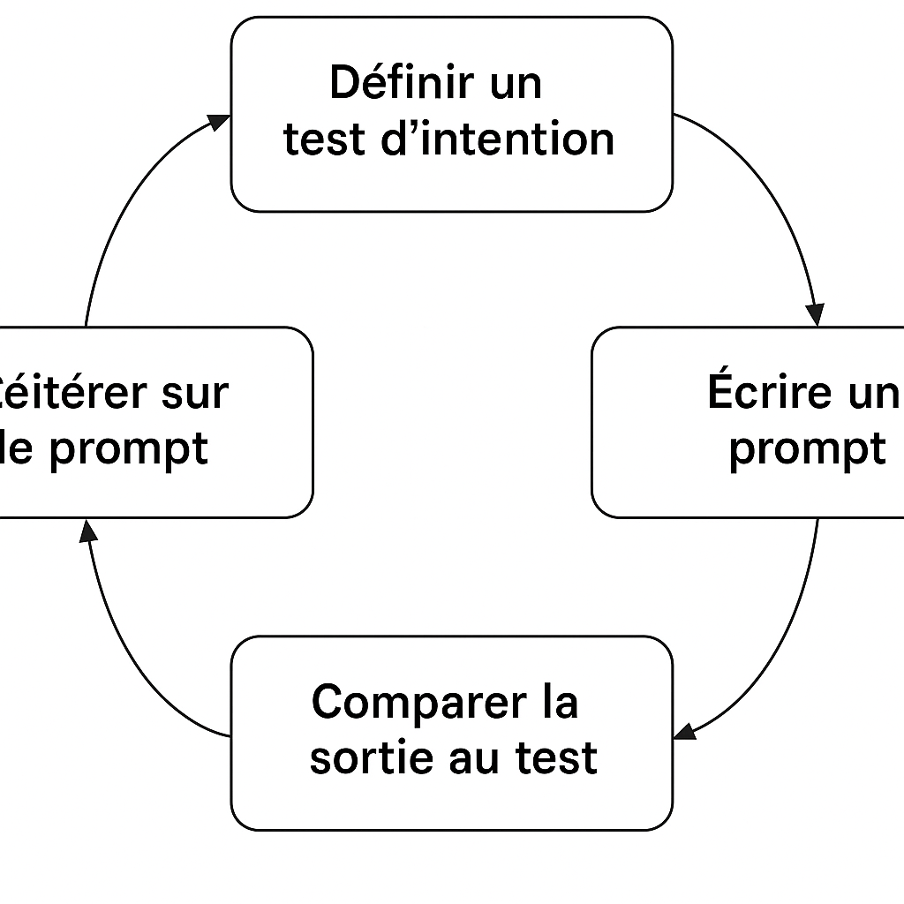

---

## Chapitre — Les motifs du dialogue : construire un langage de conception avec les LLM

> Comment capturer les meilleures pratiques d’interaction avec une IA ? Ce chapitre présente une collection de motifs issus du terrain, testés, réutilisables et adaptables.

Dans ce chapitre, nous allons explorer les motifs fondamentaux qui émergent de l’interaction régulière entre un développeur et un LLM. Ces motifs sont les unités de base d’un nouveau langage de conception, façonné non plus uniquement par les frameworks ou les langages de programmation, mais par les récurrences d’usage entre l’humain et le modèle. Ils forment une bibliothèque de pratiques réutilisables, adaptables, que les équipes peuvent combiner, faire évoluer, et transmettre.

L’objectif est ici de mettre en lumière des structures de pensée récurrentes, des scénarios typiques, et des séquences d’interaction efficaces. Par exemple :

* Comment amorcer un dialogue avec un LLM quand on part d’une idée floue ?
* Comment affiner un besoin technique à travers plusieurs itérations ?
* Comment structurer la co-écriture de code, de tests ou de documentation ?
* Comment obtenir une aide sur une impasse ou une panne conceptuelle ?

Ces situations sont autant d’occasions de formaliser des motifs. Nous les présenterons à travers une fiche type comprenant : nom, contexte, problème, solution, conséquences, et exemples. Le tout vise à construire un langage partagé qui outille les praticiens, tout en renforçant leur posture critique.

### Motif 1 : « Question Socratique » — Reformuler pour comprendre

**Contexte** : Vous êtes confronté à un besoin exprimé de manière floue ou partielle (ex. : "Je veux faire une API pour envoyer des alertes en cas d'erreur système"), ou vous devez explorer un domaine que vous maîtrisez peu.

**Problème** : Un prompt trop vague entraîne souvent une réponse générique, peu exploitable ou déconnectée du contexte réel. Or, les LLM brillent lorsqu’ils sont alimentés en contraintes, en contexte, et en objectifs précis.

**Solution** : Engagez un dialogue progressif en reformulant la demande initiale sous forme de questions. Par exemple :

* "Quels types d’erreurs souhaitez-vous capturer ?"
* "Les alertes doivent-elles être transmises en temps réel ou agrégées ?"
* "Quel canal de notification privilégier (email, Slack, webhook) ?"

Cette technique, inspirée de la maïeutique socratique, pousse le demandeur (vous-même ou un collègue) à clarifier ses intentions, ce qui améliore la qualité du prompt et donc la pertinence de la réponse.

**Conséquences** :

* Le besoin devient plus clair, même pour les humains impliqués.
* Le prompt s’enrichit naturellement à chaque itération.
* Le LLM agit comme un catalyseur de réflexion, pas simplement comme un moteur de complétion.

**Exemple** : Dans un projet d'alerte météo automatisée, une équipe a d’abord demandé au LLM de "créer un script d’envoi d’alertes". La réponse obtenue ne convenait pas : elle reposait sur des hypothèses erronées (envoi par email, langage Python, etc.). En reformulant progressivement les besoins (fréquence, canal, gestion des seuils de gravité, intégration dans l’architecture existante), le LLM a fini par générer une solution beaucoup plus proche du besoin réel. Cette posture a ensuite été institutionnalisée dans l’équipe sous la forme d’un atelier régulier de co-design assisté par LLM.

### Motif 2 : « Exploration Guidée » — Décomposer pour mieux avancer

**Contexte** : Vous devez concevoir une fonctionnalité complexe, découvrir un domaine technique inconnu, ou explorer une solution potentielle dont les tenants et aboutissants vous échappent encore.

**Problème** : Lorsque vous posez une question large ou trop abstraite à un LLM (ex. : "Comment concevoir une API REST sécurisée ?"), la réponse obtenue peut être trop généraliste, peu exploitable, voire source de confusion. Le LLM donne l'impression de « savoir tout faire » mais sans guider efficacement le cheminement.

**Solution** : Adoptez une posture d’exploration progressive en demandant au LLM de découper la tâche ou le domaine en étapes claires. Utilisez des formulations comme :

* "Peux-tu me décrire les grandes étapes pour… ?"
* "Quelle serait une première version minimale (MVP) ?"
* "Quels choix technologiques sont à envisager, et pourquoi ?"
* "Propose un plan d’implémentation par étapes."

Le but est de transformer une montagne confuse en une série de collines franchissables.

**Conséquences** :

* Le LLM joue un rôle de guide structurant, aidant à prioriser les étapes.
* La charge cognitive est réduite, car vous avancez pas à pas.
* Le dialogue devient un levier de formation continue : chaque étape est une occasion d’apprentissage ciblé.

**Exemple** : Dans un projet de migration d’une application monolithique vers une architecture en microservices, une développeuse ne savait par où commencer. Plutôt que de demander "Comment faire la migration ?", elle a utilisé l’exploration guidée : "Peux-tu me proposer un plan en cinq grandes étapes pour migrer un monolithe vers des microservices, avec les pièges courants à éviter ?" Le LLM a alors proposé une approche itérative, incluant la cartographie des dépendances, la séparation des contextes métier, la mise en place d’une couche d’API Gateway, et des stratégies de test spécifiques. Chaque étape a ensuite été discutée plus en détail, facilitant la prise de décision et la coordination avec l’équipe.

---

> **Encadré : Une session de pairing augmentée**
>
> Lors d’une séance de co-développement, deux développeurs travaillent ensemble à concevoir un module de traitement de factures. L’un d’eux propose d’interroger le LLM pour structurer le travail. Le prompt initial : *"Comment concevoir un module de traitement de factures dans un ERP ?"* produit une réponse dense mais confuse.
>
> L’un des développeurs reformule alors : *"Peux-tu me proposer une décomposition en étapes pour construire ce module, du point de vue fonctionnel et technique ?"*
>
> Le LLM répond :
>
> * Identifier les sources de données (factures fournisseurs, clients).
> * Définir les règles de validation.
> * Modéliser les statuts de traitement.
> * Intégrer les notifications.
> * Prévoir l’export comptable.
>
> À partir de cette réponse, les deux développeurs réorganisent leur backlog, définissent les premières user stories, et rédigent ensemble les spécifications du MVP. Le LLM a non seulement servi de facilitateur technique, mais aussi de médiateur de compréhension mutuelle, révélant des angles morts et clarifiant les priorités. L’exploration guidée a permis de sortir du flou initial pour entrer dans l’action concrète.

---

### Motif 3 : « Spécification Inversée » — Obtenir un plan à partir du code

**Contexte** : Vous découvrez un morceau de code existant, hérité ou généré automatiquement, mais dont les intentions ne sont pas documentées ou pas comprises. Vous devez le maintenir, le refactorer ou le réécrire, mais vous manquez de vision sur sa finalité, ses contraintes ou sa logique métier.

**Problème** : Lorsque le code précède la conception (cas fréquent avec les LLM), il devient difficile d’en déduire les intentions originales. Cela ralentit la compréhension, multiplie les erreurs et fragilise la maintenabilité. Le risque est de bricoler sans fond, ou de produire de la dette technique involontairement.

**Solution** : Utilisez le LLM pour reconstituer les intentions implicites à partir du code : faites-lui "remonter" les spécifications à partir d’un extrait de code donné. C’est l’inverse du schéma habituel (besoin → code) : ici, on produit la documentation ou le plan de test *à partir* du code. Vous pouvez formuler des demandes comme :

* "Peux-tu me décrire ce que ce code est censé faire, étape par étape ?"
* "Quelles règles métiers peux-tu déduire de ce traitement ?"
* "Peux-tu générer une documentation technique à partir de ce fichier ?"
* "Quelles hypothèses ce code semble-t-il faire sur les données ?"

**Conséquences** :

* Le code devient un point d’entrée vers la compréhension métier.
* Les équipes peuvent mieux documenter des systèmes anciens ou mal maintenus.
* Cela permet de générer des cas de test à partir de l’implémentation existante.

**Exemple** : Une développeuse reprend un ancien script Python d’analyse de logs réseau, sans documentation ni tests. Elle copie le code dans un prompt et demande au LLM : *"Explique-moi ligne par ligne ce que fait ce script et quelles règles d’analyse il applique."* Le LLM identifie plusieurs étapes (filtrage par IP, regroupement par heure, détection d’anomalies par seuil), qu’il reformule sous forme d’un pseudo-algorithme. La développeuse peut alors générer une série de tests unitaires, identifier une condition oubliée (filtres sur protocoles), et décider de refactorer le tout sous forme de classes. Le modèle a joué ici le rôle de traducteur et de cartographe inversé.

---

> **Encadré : Un LLM comme auditeur de code**
>
> Lors d’un audit technique sur un système de facturation, une équipe se retrouve face à un module PHP de plus de 800 lignes, écrit il y a 8 ans, sans tests ni documentation. Plutôt que de l'analyser ligne par ligne, l’équipe décide de le soumettre au LLM par blocs successifs.
>
> À chaque itération, le prompt est : *"Quels traitements réalise ce bloc de code ? Quelle règle métier cela semble-t-il implémenter ?"*
>
> Le LLM identifie la détection de doublons, la vérification de TVA, la gestion d’arrondis, et les cas particuliers de facturation croisée. Ces éléments sont mis en parallèle avec les processus métier décrits dans la documentation client, révélant plusieurs écarts non documentés.
>
> Cette approche de spécification inversée a permis de :
>
> * Documenter rétroactivement un système critique,
> * Réconcilier la logique métier et l’implémentation réelle,
> * Planifier une refonte progressive sans repartir de zéro.

---

### 🌀 Variantes du motif « Spécification Inversée »

#### 📌 Variante 3.1 : *Reconstruction d’User Stories*

Au lieu de demander uniquement *ce que fait le code*, on pousse le LLM à reformuler les intentions en *termes fonctionnels utilisateur*. Exemple de prompt :

> *« En supposant que ce code corresponde à une fonctionnalité d’un produit, quelle user story pourrait-on en déduire ? »*

**Usage** : utile dans des projets où le code a été produit avant la formalisation des besoins (souvent le cas dans des prototypes ou des phases de hackathon).

#### 📌 Variante 3.2 : *Déduction des Hypothèses*

Demandez au LLM :

> *« Quelles hypothèses implicites ce code semble-t-il faire sur les données, les contextes d’exécution ou les droits d’accès ? »*

**Usage** : précieux pour détecter des biais implicites, des présupposés sur les inputs, ou des angles morts en sécurité.

#### 📌 Variante 3.3 : *Contrat implicite*

Demandez :

> *« Peux-tu expliciter un contrat d’interface pour cette fonction / ce module (types d’entrées, sorties, erreurs gérées) ? »*

**Usage** : aide à produire des *Design by Contract* à posteriori, ou à documenter des API sans doc initiale.

---

### 🛠 Mises en pratique concrètes

#### ✅ Pratique 1 : Générer les tests à partir de l’implémentation

Prompt-type :

> *« Génère une suite de tests unitaires couvrant les cas normaux, limites et erreurs de cette fonction. »*

**Résultat** : Le LLM suggère souvent des cas non couverts dans le code, révélant des lacunes potentielles.

---

#### ✅ Pratique 2 : Écrire la documentation avant refactorisation

Demande :

> *« Rédige une documentation technique synthétique (fonction, paramètres, exceptions, effets secondaires) à partir de ce code. »*

**Usage** : crée un point d’ancrage avant transformation, utile pour la relecture et le pair programming.

---

#### ✅ Pratique 3 : Détecter les effets de bord

Prompt :

> *« Est-ce que ce code a des effets secondaires non visibles immédiatement (ex. : écritures sur disque, accès à des variables globales, dépendances réseau) ? »*

**Usage** : audit de code legacy ou critique, base pour migration vers du code pur / testable.

---

### 🔄 Intégration dans un workflow d’équipe

Voici une **routine de revue de code assistée** utilisant ce motif :

1. 🔍 *Sélectionner une fonction critique à revoir.*
2. 🧠 *Demander au LLM de reformuler son intention métier.*
3. ✅ *Générer les tests que cette fonction est supposée passer.*
4. 🔄 *Comparer avec les tests existants.*
5. ✏️ *Documenter ou enrichir à la volée.*
6. 🛠 *Décider d’un refactor ou non.*

> 🔧 **Outil compagnon possible** : Un plugin ou script intégré dans l’IDE qui, à la sélection d’une fonction, envoie automatiquement un prompt de spécification inversée au LLM et affiche les hypothèses métier dans une fenêtre latérale.

---

### 🧭 Posture recommandée

* Ne pas se contenter de *ce que le LLM dit*, mais comparer avec les hypothèses de l’équipe.
* Utiliser les réponses comme **base de discussion**, notamment avec les parties prenantes non techniques.
* Croiser les approches : spécification inversée → exploration guidée → design dialogué.

---

### Motif 4 : « Modèle Miroir » — Comparer plusieurs versions pour éclairer un choix

**Contexte** : Vous hésitez entre plusieurs implémentations possibles (par exemple, deux structures d’API, deux algorithmes, deux stratégies d’architecture), ou vous avez généré plusieurs variantes avec le LLM et souhaitez les évaluer de façon argumentée.

**Problème** : Lorsqu’on explore des options seul ou en équipe, il est facile de se focaliser sur une solution "plausible" sans bien comprendre les différences, les conséquences ou les alternatives. Le LLM, sans guidance, tend à générer une seule réponse par défaut.

**Solution** : Exploitez le LLM comme un **miroir comparatif**. Demandez-lui explicitement de produire *plusieurs* versions d’une même solution, puis de **les comparer lui-même selon des critères définis**. C’est une mise en tension productive entre options, qui stimule l’analyse critique.

#### Prompt-type :

* *« Propose-moi 3 variantes de cette fonction avec des styles ou des structures différentes. Puis compare-les sur lisibilité, performance, testabilité. »*
* *« Voici deux options d’architecture microservices. Peux-tu me les comparer sur les plans de la résilience, de la scalabilité, et de la complexité opérationnelle ? »*

**Conséquences** :

* On décentre le raisonnement : ce n’est plus "la bonne solution", mais "la plus adaptée au contexte".
* Cela entraîne une meilleure explicitation des critères de choix.
* Le LLM devient partenaire d’un raisonnement dialectique, pas seulement un fournisseur de contenu.

---

### 🧪 Exemple concret

Lors d’un projet de refonte de système de paiement, l’équipe hésite entre :

1. Une architecture orientée événements avec Kafka.
2. Une architecture RESTful classique avec appels synchrones.

Le LLM est sollicité via ce prompt :

> *« Voici deux options d’architecture. Peux-tu détailler les avantages, risques et implications de chacune pour un système à haute disponibilité devant traiter 100 transactions par seconde ? »*

Le modèle identifie que :

* Kafka apporte résilience et découplage, mais complexifie la supervision.
* REST est plus simple à auditer mais moins robuste en cas de pics de charge ou d’erreurs réseau.

Cette analyse partagée permet à l’équipe de trancher plus sereinement, *en conscience*.

---

> 🧭 **Encadré : Le LLM comme miroir d’équipe**
>
> Dans une réunion de design technique, une équipe ne parvient pas à se mettre d’accord entre deux styles de validation de formulaire côté frontend : impératif (en JS pur) ou déclaratif (via une lib type Formik ou React Hook Form).
>
> Un développeur propose de demander au LLM une comparaison structurée.
>
> Le prompt devient : *« Compare les styles impératif et déclaratif de validation de formulaire côté React. Donne des exemples de code et compare sur maintenabilité, UX et facilité de test. »*
>
> Le LLM répond avec clarté, exemples à l’appui, révélant que le choix dépend du niveau de complexité métier attendu et de l’organisation du code. Cela permet à l’équipe de ne pas trancher "par opinion", mais sur des critères explicites.
>
> Le modèle a servi ici de **facilitateur de clarification technique collective**, sans remplacer la décision humaine.

---

### 🔄 Variantes du motif « Modèle Miroir »

* **Miroir de styles** : comparer plusieurs styles de code pour une même logique (ex. fonctionnelle vs orientée objet).
* **Miroir de paradigmes** : comparer des approches (ex. polling vs event-driven).
* **Miroir de technologies** : comparer frameworks, langages, ou bibliothèques en fonction d’un usage ciblé.

---

### Motif 5 : « Clarification par contre-exemple » — Explorer les limites d'une proposition

**Contexte** : Après avoir reçu une réponse satisfaisante d’un LLM, il arrive que des doutes subsistent : le code proposé est-il robuste ? La solution envisagée tient-elle dans tous les cas ? Les limites implicites du raisonnement sont-elles comprises ?

**Problème** : Un prompt initialement bien formulé peut conduire à une réponse correcte mais trop optimiste ou générique. Le LLM tend à « deviner » une solution type, sans toujours prendre en compte les cas limites, les exceptions ou les erreurs de conception possibles. Cela donne l’illusion de maîtrise, là où il faudrait de la rigueur.

**Solution** : Demander explicitement un contre-exemple ou une situation qui ferait échouer la solution proposée. Cette approche vise à forcer la mise en lumière de zones grises, d’angles morts ou de présupposés implicites. On peut formuler par exemple :

* "Quel cas d’usage pourrait faire échouer cette architecture ?"
* "Donne-moi un exemple où ce code produit un comportement inattendu."
* "Y a-t-il un scénario qui rendrait ce modèle inefficace ?"

Cette manière de questionner pousse le modèle (et le praticien) à réfléchir en creux, par la négation ou l’invalidation.

**Conséquences** :

* Renforce la robustesse de la solution en mettant à l’épreuve ses fondements.
* Favorise une posture critique et antifragile dans la conception.
* Transforme le LLM en simulateur d'obstacles potentiels, utile pour la revue de code ou la documentation des limites d’un système.

**Exemple** : Dans un atelier sur la génération d’algorithmes de parcours de graphe, un étudiant a demandé à ChatGPT de lui fournir une version optimisée de Dijkstra en JavaScript. Le code généré semblait parfaitement fonctionnel. En testant ensuite la robustesse du résultat via la question : "Et si le graphe est orienté avec des cycles négatifs ?", le LLM a admis que l’algorithme proposé ne convenait pas, et a suggéré de basculer sur Bellman-Ford avec un test d'intégrité des poids. Cette interaction a permis non seulement d’enseigner les limites d’un algorithme, mais aussi d’aiguiser l’esprit critique face à la "bonne réponse".

---

> 📌 **Encadré — Posture réflexive : oser douter du bon élève**
>
> L’une des illusions les plus tenaces dans l’usage des LLM est celle de la "réponse parfaite" dès la première itération. Un motif comme "Clarification par contre-exemple" invite à adopter une posture scientifique : tester, falsifier, chercher ce qui ne va pas, même quand tout semble aller bien. Cela s’apparente à une relecture interne du raisonnement — une forme de revue de code dialoguée — où le développeur devient enquêteur des failles possibles. C’est aussi une manière de former les plus jeunes à ne pas confondre autorité de l’outil et vérité absolue.

Voici une **fiche de motif** associée au *Test-Driven Prompting*, conforme à la structure utilisée dans les chapitres précédents :

---

### Motif 6 : « Prompt Piloté par les Tests » — Définir les attentes avant d’écrire

**Contexte**
Vous devez rédiger un prompt pour un usage récurrent (génération de code, reformulation de besoin, structuration de contenu…), mais vous obtenez des réponses fluctuantes, incomplètes ou peu adaptées. Vous voulez rendre votre prompt plus fiable, explicite et partageable.

**Problème**
Un prompt écrit "au feeling" donne des résultats aléatoires. Sans critères de qualité explicites, il est difficile de dire si la réponse du LLM est satisfaisante ou non. Cela rend les itérations peu reproductibles et l’apprentissage limité.

**Solution**
Adoptez une démarche inspirée du Test-Driven Development : avant de rédiger le prompt, écrivez un ou plusieurs **tests d’intention** qui décrivent ce que vous attendez du LLM. Ce peuvent être :

* des exemples de sortie ;
* des critères formels (format, style, structure) ;
* des contraintes de contexte ou de contenu.

Utilisez ensuite ces tests pour guider l’écriture du prompt. Faites-le évoluer jusqu’à ce qu’il satisfasse les attentes définies.

**Conséquences**

* Vous gagnez en clarté sur ce que vous attendez vraiment du modèle.
* Vos prompts deviennent plus robustes, plus réutilisables et plus faciles à transmettre.
* Vous pouvez constituer une bibliothèque de prompts testés, versionnés et documentés.
* Le dialogue avec le LLM devient une activité d’ingénierie à part entière, structurée et maîtrisée.

**Exemple**
Une équipe travaillant sur un assistant de support client voulait générer automatiquement des réponses types à partir de tickets. Le prompt initial donnait des textes trop longs, trop formels et parfois hors sujet. En définissant des tests d’attente clairs — *"Réponse ≤ 3 phrases, ton empathique mais professionnel, ne jamais inclure d’excuses juridiques"*, etc. —, l’équipe a pu concevoir un prompt beaucoup plus précis. Celui-ci a été intégré dans leur base de connaissance, avec des versions pour différents registres de langue selon le client.

**Variations**

* **TDP visuel** : utilisez des "mock outputs" (sorties fictives attendues) comme référence.
* **TDP collaboratif** : faites définir les attentes par plusieurs membres de l’équipe (produit, technique, UX).
* **TDP dans le prompt** : incluez directement le test dans le prompt lui-même (ex. : *"Voici un exemple de réponse attendue..."*).

    

---

