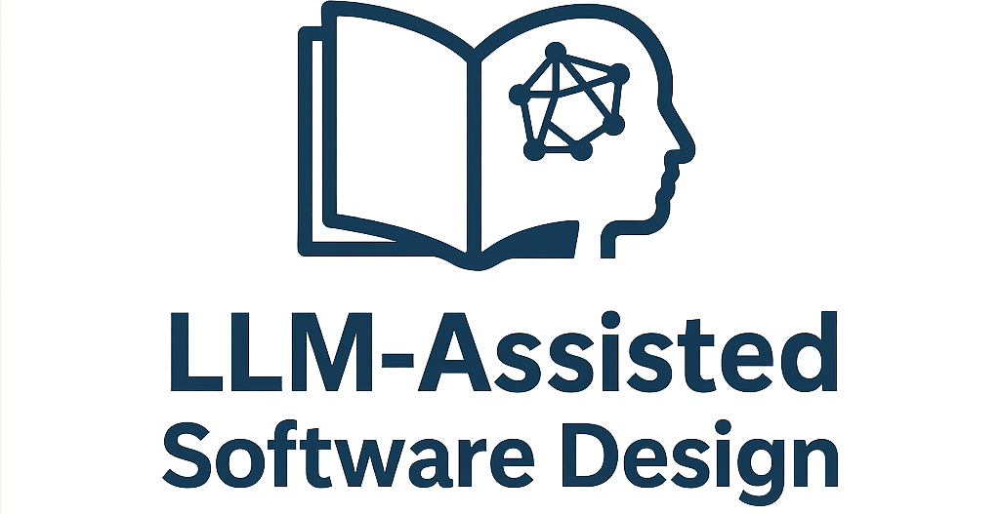

# **LLM-Assisted Software Design** 

## *Un langage de motifs pour les nouvelles pratiques de conception logicielle*

<h2 style="text-align: center; font-size: 18pt; color: #f582ae; font-style: italic;">
    “Design is intelligence made visible.” – Alina Wheeler
</h2>

### Samuel Bastiat *avec la forte collaboration d’un LLM (GPT-4.5) et le soutien de Gemini et Copilot*

### *[Idée originale](https://contretemps.azeau.com/post/LLM-assisted-software-design-pattern-language/)*  d’Olivier Azeau

### *Bêta-lecteurs* Gowen Pottiez, Guillaume Saint-Etienne, Cindy Schlaufmann, Philippe Charrière

---

### Édition numérique — 2025

Licence Creative Commons Attribution - Utilisation non commerciale - Pas d’Œuvre dérivée 4.0 International (CC BY-NC-ND 4.0)
[https://creativecommons.org/licenses/by-nc-nd/4.0/)

---

Ce livre est un projet vivant.
Sa version complète et ses mises à jour sont disponibles en accès libre sur GitHub :
**[github.com/s31db/llm-dev-books](https://github.com/s31db/llm-dev-books)**

---

### Remerciements

Ce travail a bénéficié de l’inspiration, des retours et des échanges avec des praticiens passionnés et bien sûr… d’une intelligence artificielle attentive.

