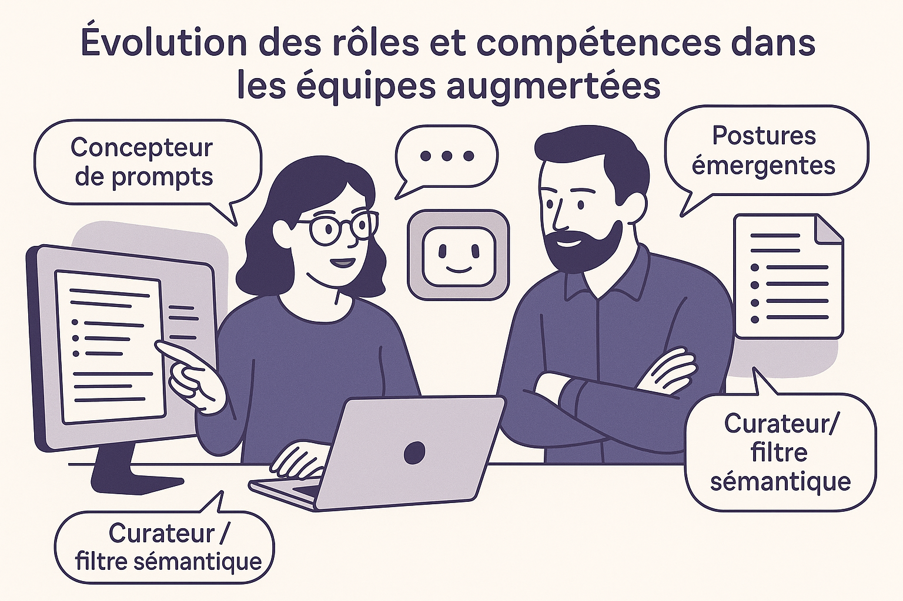

---

## 👥 Chapitre 4 — Nouveaux rôles, nouvelles compétences : l’évolution des équipes augmentées

    

> Concevoir avec un LLM, ce n’est peut-être pas seulement une question d’outillage. Cela pourrait représenter un changement plus profond dans la manière dont les rôles s’exercent, se redéfinissent… ou s’adaptent en continu.

---

### 📌 Pourquoi ce chapitre ?

Nous avons vu comment interagir efficacement avec un LLM (chap. 2-3) et comment structurer ces interactions sous forme de motifs (chap. 4), il devient pertinent de s’interroger sur ce que cette nouvelle pratique modifie dans la vie des équipes.

Quelques questions émergent naturellement :

* Est-ce que de **nouveaux rôles** apparaissent réellement ?
* Quelles **compétences prennent de l’importance**, même sans être nouvelles ?
* Les **rôles traditionnels** changent-ils de nature, ou seulement de modalités d’expression ?

Ces questions ne visent pas à produire une réponse définitive, mais à **ouvrir un espace d’observation**. Les transformations sont encore en cours, souvent silencieuses, parfois invisibles dans les grilles de poste. Ce chapitre propose d’en cartographier quelques lignes de force.

---

### 🧭 Deux grilles de lecture

#### **Les rôles fonctionnels**

Ce sont les rôles formels dans une équipe : développeur·euse, PO, tech lead, coach, etc. Ils s’inscrivent dans une organisation explicite, observable.

#### **Les postures conversationnelles**

Ce sont les manières d’interagir avec le LLM : poser des questions, filtrer, reformuler, explorer… Elles sont plus diffuses, mais tout aussi déterminantes dans un environnement augmenté.

> Ces deux dimensions ne s’excluent pas. Un·e développeur·euse peut adopter tour à tour des postures de **concepteur**, de **curateur**, de **testeur d’hypothèses** — selon le moment, le contexte, l’intention.

---

### 🔄 Transformation des rôles existants

Voici une lecture possible — et évolutive — des glissements observés :

| Rôle             | Évolutions possibles avec l’usage des LLM                           |
| ---------------- | ------------------------------------------------------------------- |
| **Développeur**  | De producteur de code à **concepteur de dialogues structurés**      |
| **Tech Lead**    | Devient garant du sens dans les chaînes de raisonnement hybrides    |
| **PO / PM**      | Peut gagner en autonomie sur la formulation d’hypothèses métier     |
| **UX / UI**      | Explore des variantes ou des idées de parcours de façon rapide      |
| **Coach agile**  | Introduit l’IA dans les pratiques réflexives ou les rétrospectives  |
| **Testeur / QA** | Génère et évalue des jeux de tests à partir de specs ou de prompts  |
| **Formateur**    | Utilise le LLM comme simulateur de dialogue ou base de cas concrets |

> Ces évolutions ne sont pas automatiques. Elles dépendent fortement du contexte, de la culture d’équipe, de l’intérêt individuel. L’appropriation reste inégale et expérimentale.

---

#### Le développeur augmenté : un chef d’orchestre du raisonnement

Le développeur moderne ne code plus seulement avec ses seules connaissances, mais mobilise un répertoire d’interactions avec des modèles qui savent compléter, reformuler, proposer, synthétiser. Ce changement appelle une nouvelle posture :

* **Anticiper la clarté du prompt** comme une compétence en soi.
* **Savoir détecter les biais, trous logiques ou généralisations abusives** dans les réponses.
* **Devenir le garant de l’intelligibilité** du système pour les humains à venir (lui-même, l’équipe, les auditeurs, les utilisateurs).

Cela suppose :

* de **maîtriser l’ambiguïté du langage naturel**,
* d’**exercer un regard critique sur les suggestions automatiques**,
* de savoir **transformer un résultat brut en artefact compréhensible, documenté, maintenable**.

Cette posture d’éditeur n’est pas nécessairement nouvelle — mais elle prend une **place plus centrale** dans un environnement augmenté.

> **Le développeur-éditeur**
>
> Un développeur aguerri m’a récemment dit : *« Je me sens plus proche d’un éditeur que d’un rédacteur. L’IA propose, je choisis, je coupe, je reformule, je structure. »* Ce parallèle avec le travail éditorial révèle bien la nouvelle nature de la production logicielle : elle n’est plus linéaire, mais interactive, critique, narrative.

### 🧪 Postures émergentes dans le dialogue avec le LLM

Ces postures sont souvent **transversales aux rôles**. Elles peuvent coexister, se combiner, évoluer.

#### 🎯 Le **Concepteur de prompts**

* Maîtrise les subtilités de formulation.
* Construit des canevas, des séquences, des tests d’intention.
* Optimise pour clarté, robustesse, transférabilité.

#### 🔎 Le **Curateur / filtre sémantique**

* Lit, corrige, nettoie, valide les réponses du LLM.
* Distingue signal de bruit, détecte les hallucinations.
* Structure les bonnes idées pour les intégrer.

#### 🧠 L’**Explorateur de possibles**

* Demande des variantes, des scénarios alternatifs.
* Joue avec les contre-exemples, les miroirs, les tests de limite.
* Utilise le LLM pour “penser à côté” et élargir le champ.

#### 📚 Le **Documentaliste augmenté**

* Génère des résumés, des guides, des onboarding packs.
* Organise la connaissance produite par le LLM.
* Capitalise et partage les prompts efficaces.

#### 🧰 Le **Concepteur de motifs**

* Observe les récurrences d’usage.
* Formalise des motifs pour les transmettre.
* Participe à la culture d’équipe augmentée.

#### 🌿 Le **Soigneur holistique**

* Cherche à comprendre les causes profondes d’un problème au-delà de ses symptômes.
* Utilise le LLM comme partenaire d’investigation systémique : Neuf Pourquoi (Nine Whys), arbres des causes, hypothèses multiples.
* Élabore des pistes d’action ciblées selon les causes racines, en tenant compte des interactions humaines, techniques et organisationnelles.
* Adopte une posture d’écoute, de questionnement lent, de mise en lien des signaux faibles.

---

### 🧩 Compétences transverses à renforcer

Certains savoir-faire deviennent transversaux à tous les métiers techniques :

| Compétence                     | Pourquoi elle devient critique avec un LLM                   |
|--------------------------------|--------------------------------------------------------------|
| **Formulation claire**         | Condition de toute interaction efficace                      |
| **Sens critique technique**    | Pour éviter de suivre aveuglément les réponses               |
| **Curiosité exploratoire**     | Pour tirer parti des suggestions inattendues                 |
| **Capacité à synthétiser**     | Pour consolider les décisions issues du dialogue             |
| **Éthique de l’usage**         | Pour encadrer les biais, les risques, la documentation       |
| **Transmission des pratiques** | Pour faire vivre les motifs, les capitaliser et les partager |

Ces compétences peuvent s’apprendre, s’observer, se cultiver. Elles mériteraient peut-être d’être mieux valorisées.

---

### 🧪 Illustrations de terrain

#### 🔁 Binôme augmenté

Dans un projet de refonte d’application, un développeur junior et un développeur senior travaillent en binôme avec un LLM. Le junior joue le rôle de **rédacteur de prompt**, propose des idées. Le senior filtre, restructure, donne du contexte. Le LLM devient un **troisième partenaire** silencieux, parfois inspirant, parfois fragile. Ensemble, ils co-conçoivent des modules documentés, testés, discutés.

#### 🧭 Rétrospective augmentée

Dans une équipe de développement, le Scrum Master a proposé d’utiliser un LLM comme co-facilitateur de la rétrospective. Les membres de l’équipe formulaient les irritants ou les réussites du sprint, et le modèle proposait des regroupements, des axes de réflexion, voire des pistes d’action. Le rôle du Scrum Master a évolué : il ne centralisait plus les idées, mais orchestrait une interaction triangulaire entre les voix humaines et la synthèse IA. Cette expérimentation a révélé de nouvelles compétences nécessaires : relecture critique, adaptation en direct, design de flux de dialogue.

---

### 🎓 Vers de nouveaux rôles ?

Certains rôles émergents apparaissent dans les organisations :

* **Prompt Designer**
* **IA Facilitator**
* **Architecte Cognitif**
* **Curateur de connaissances générées**

Ces rôles sont encore marginaux. Ils posent aussi des questions : **faut-il nommer ce qui peut rester diffus ?**
Peut-être s’agit-il moins d’ajouter des postes que de **reconnaître les compétences émergentes là où elles s’exercent déjà**, souvent de manière invisible.

---

### ✏️ En synthèse ouverte

* Les LLM **n’imposent pas de nouveaux rôles**, mais rendent possibles de **nouvelles postures**.
* Les équipes gagneraient à **observer comment elles s’approprient ces outils**, à leur manière.
* L’enjeu est moins de formaliser un nouvel organigramme que de **créer un espace pour explorer, nommer, transmettre** ce qui change dans les gestes du quotidien.

> Le dialogue entre humains et IA n’est pas figé. Il se négocie, se cultive, s’apprend. C’est peut-être là que réside le cœur des compétences de demain.

> Un bon dialogue avec un LLM, c’est comme un bon design logiciel : clair, modulaire, itératif… et profondément humain.
