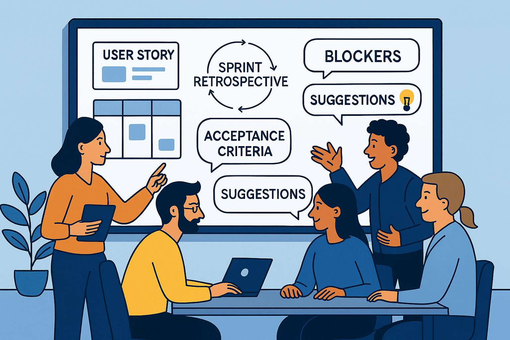

---

## 🌀 Chapter 8 — Augmented Agility?

> What if the LLM became a new kind of team member?
> Not an automated developer, but a **conversation stimulator**, a **thinking accelerator**, a **posture mirror**.

---

### 🧭 Why This Chapter?

At its core, agility rests on short cycles, constant adaptation, and close collaboration. At first glance, LLMs might seem foreign to this human, incremental culture.

And yet… used wisely, they can **accelerate certain flows**, enrich collective thinking, and make practices easier to adopt.

This chapter explores **how agility can be enhanced by LLMs — without losing its soul.**

---

### 🔁 Agile Principles Revisited Through AI

| Agile Principle | What the LLM Enables (or Questions) |
|-----------------|-------------------------------------|
| Constant Collaboration | Simulate viewpoints, prototype ideas, challenge choices |
| Responding to Change | Quickly revise specs or code in response to a new constraint |
| Simplicity      | Reframe a complex solution to extract its essence |
| Rapid Feedback  | Generate tests, compare variants, explore alternatives |
| Self-Organizing Teams | Support decision-making, formalize emerging ideas |

> The LLM doesn’t replace the team. It **tools its reflexivity.**

---

### 🔧 Ritual by Ritual: What Changes With the LLM?

#### The AI as Silent Pair in Planning

During *sprint planning*, an LLM can help clarify user stories, generate variants, or estimate alternative scenarios. For example, a product team might ask:

> *“What edge cases should we consider for this user story?”*

or:

> *“Can you propose three different ways to implement this feature with pros/cons?”*

The model doesn’t make the decision, but it broadens the reflection space.

---

#### Writing Tests and Acceptance Criteria

One of the most direct agile uses is generating (or verifying) **automated tests** or **acceptance criteria** from a user story. This naturally aligns teams on the *“definition of done”* while reducing oversights.

> *User story: As a logged-in user, I want to receive a notification when a new message arrives.*
> → *Generated acceptance criteria:*
>
> * The user is logged in.
> * A message is received.
> * A notification appears within 3 seconds.
> * The user can click the notification to open the message.

---

#### Augmented Daily Meetings

Without replacing human exchanges, an LLM can help synthesize key points discussed the day before or generate a daily summary of tickets in progress, identified blockers, or critical dependencies. Integrated into a tool like Jira or GitHub, this frees time for more qualitative discussions during dailies.

> **Example**: A team connected an LLM to its Kanban board. Each morning, an automated summary of board movements was proposed. This improved responsiveness on blocking points.

> **Quick actions**
>
> * Reframe blockers as prompts to make them actionable
>
> * Quickly generate workarounds
>
> * Share prompts used the previous day as instant “lessons learned”
>
> > *“Yesterday I used an implementation mirror to unblock my PR.”*

---

#### The AI as a Mirror in Retrospectives

One of the most interesting emerging uses is **assisted reflective analysis**. By analyzing ticket logs, code comments, or meeting transcripts, an LLM can detect recurring patterns of tension, delay, or lack of clarity.

> *“Over the last three sprints, which user stories required more than two test iterations?”*
> *“Can you spot commonalities between bugs reported in production?”*

This doesn’t exclude human collective intelligence but helps **ask better questions** in retrospectives.

---

#### Good Practices for Healthy Integration

* **Co-build usage**: the team should collectively decide when and how to use LLMs.
* **Maintain transparency**: document exchanges with the model, archive key prompts.
* **Keep human control**: the AI proposes, but the team decides.
* **Foster mutual learning**: regular monitoring of AI usage in the team can create a culture of continuous improvement.
* **Identify biases**: always validate the LLM’s suggestions, especially on architecture, security, or performance choices.

> **“Is the AI a Team Member?”**
>
> This question often arises. Can an LLM be considered a *virtual team member*? For some, personifying it helps structure interactions (e.g., “our team assistant”). For others, it dilutes collective responsibility. A middle ground is to see it as **an intelligent facilitation tool**, accessible to all and governed by shared usage rules.

---

### 🚩 Risks and Caution

| Risk | Explanation / Examples |
| ---- | ---------------------- |
| **Cognitive Overload** | Too many prompts, too many suggestions to sift through |
| **Generative Tunnel Effect** | Following an AI suggestion without questioning it |
| **Illusion of Velocity** | Generating fast ≠ moving forward better |
| **Decision Bias** | Model proposes an “average” without considering real context |
| **Blind Automation** | Replacing human conversations with unreviewed AI answers |

> Agility is a feedback culture. The LLM must **never cut out the human loop.**

---

### ✏️ In Summary

* Agility doesn’t need to be replaced. It can be **augmented** by thoughtful use of LLMs.
* **Rituals become places to activate motifs.**
* The LLM becomes a **facilitation tool, not a production automaton.**
* This requires **collective vigilance**, a usage framework, and a shared language.

    

> A well-used LLM makes the team more autonomous, more reflective, more aligned.
> Misused, it can **short-circuit the fundamentals** of agility.
