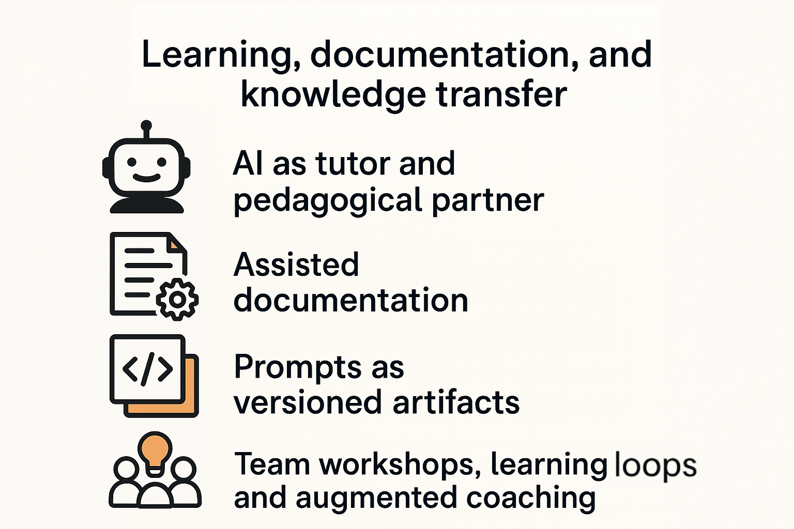

---

## 🧱 Chapter 10 — Passing It On: Teaching, Training, and Sharing the Motifs

A motif, by nature, is meant to be shared.

> It’s not an individual trick, but **embodied knowledge, transmitted and enriched in context.**

---

### 🎯 Why This Chapter?

A pattern language only has value if it is:

* **practiced**,
* **questioned**,
* **integrated**,
* **transmitted**.

This chapter addresses a key question: **how can you bring the motifs to life within your organization, your community, or your practice ecosystem?**

    

---

### 🧑‍🏫 Initial Training: Learning by Doing

#### 🧪 1. Introductory Workshops

| Workshop                       | Objective                            | Duration | Format               |
|--------------------------------|--------------------------------------|----------|----------------------|
| **Prompt Dojo**                | Create a prompt, iterate it, test it | 1h       | Pairs / small groups |
| **Exploration Through Motifs** | Solve a problem using a motif        | 1h30     | Real-life use case   |
| **AI Conversation Decryption** | Analyze a generated interaction      | 45 min   | Mirror exercise      |

> Each workshop focuses on one or two **conversational moves**. The goal is appropriation, not exhaustiveness.

---

### 🤝 Ongoing Transmission: Keeping the Motifs Alive in the Team

#### 📚 2. Sharing Lived Motifs

Examples of practices:

* Reserve 10 minutes in retrospectives for “the motif of the sprint.”
* Keep a **team journal** of notable LLM interactions.
* Add a “motif used” field in pull requests.

> A shared motif becomes a **touchstone for aligning practices**.

---

#### 🧩 3. Creating Team Motifs

A team can create its own motifs:

1. Choose a frequent situation (e.g., “refactoring after a bug”).
2. Identify what works with the LLM.
3. Name the motif, give it a form.
4. Document it (tool sheet, lessons learned, capture).

> This approach fosters a reflective, transmissible culture.

---

#### 💬 4. Augmented Testimony: Conversational Retex

During a business workshop, a member presents a successful (or unsuccessful) LLM interaction:

* Prompt objective
* Result obtained
* What helped or blocked
* Motif used or emerging

This short format (10–15 minutes) promotes the **democratization of the pattern language** without requiring prior expertise.

---

### 🌍 Broader Sharing: Beyond the Team

* Inside an internal community (tech guild, company Slack): channel `#prompt-examples`
* In an open community (dev.to, conferences, forums): blog post “3 motifs that help me every day”
* In a training program: integrate motifs as “posture pillars”

---

### 🧠 A Posture to Pass On

> Transmitting a motif is not about handing over a solution.
> It’s an invitation to experiment, to adjust, to create meaning.

The pattern language is alive. It calls for:

* **Curiosity** (dare to test),
* **Lucidity** (know what doesn’t work),
* **Generosity** (share your finds, your missteps, your doubts).

---

### ✏️ In Summary

* Motifs are tools for learning **by and for practice**.
* Their transmission happens through **simple, embodied, reproducible formats**.
* Building a sharing culture around motifs means **anchoring good LLM practices for the long term**.

> An organization that learns to share its motifs becomes **a reflective, augmented, resilient organization.**
