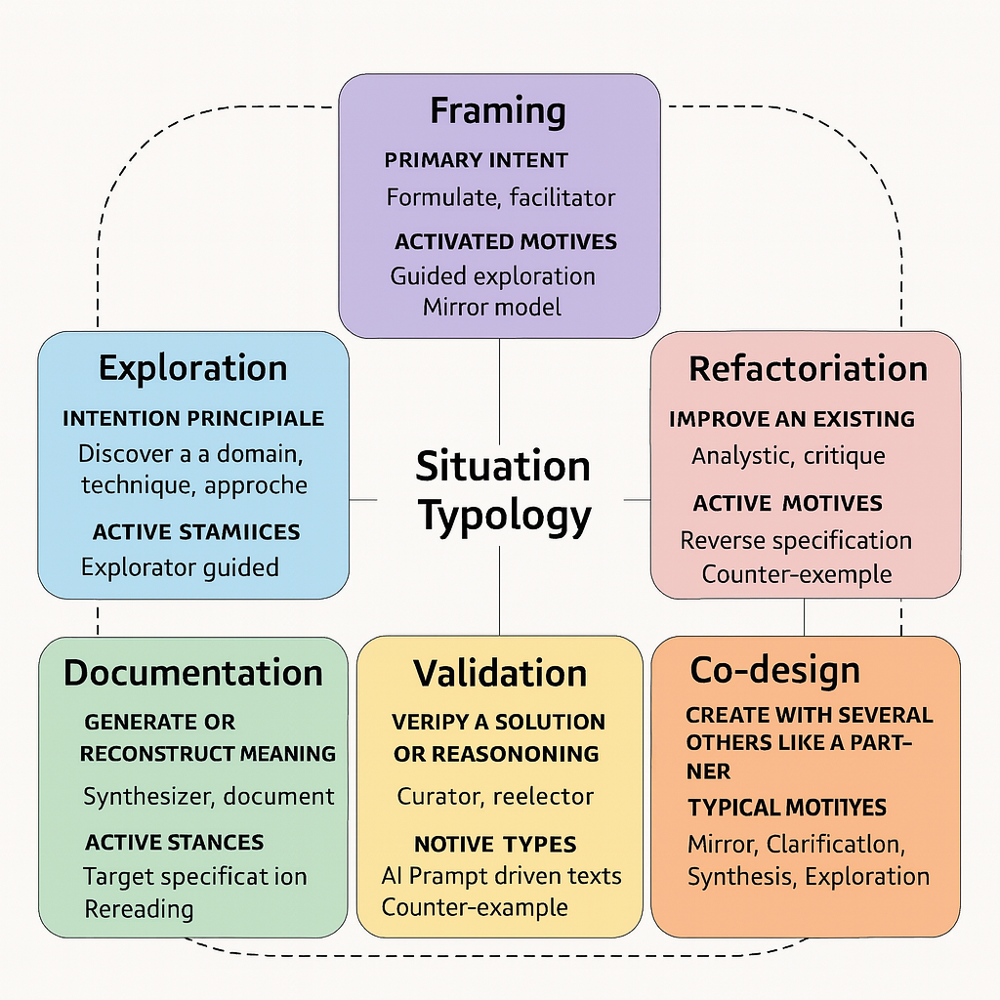

---

## 🗺️ Chapter 5 — Mapping Uses: Typology of Situations and Roles

> Designing with an LLM isn’t about applying a linear method. It’s about **navigating a space of possible interactions**, which varies depending on context, intent, and maturity level. This chapter offers a **map of these uses** — both to orient yourself and to enrich your practice.

---

### 🧭 Why This Chapter?

We’ve explored:

* **Conversational patterns** (Chapter 3) — the basic gestures of interacting with an LLM,
* **Roles and postures** emerging in teams (Chapter 4) — the ongoing transformations.

It’s now time to **connect these dimensions to the field** — to what you actually do with an LLM in specific situations.

> The goal isn’t to exhaustively model all use cases but to provide a **compass**: to recognize where you are, choose an appropriate pattern, and evolve toward more fluid and conscious practices.

---

### 🧩 Typology of Situations

Here’s an initial **typology of six common situations** frequently encountered in LLM-augmented software work. Each situation is described by:

* a **central intent** (what you’re trying to do),
* **postures activated** (how you interact with the LLM),
* **associated patterns** (the most useful conversational gestures).

| 🧩 Situation      | 🎯 Main Intent                               | 👤 Activated Posture(s)    | 🧠 Typical Patterns                               |
|-------------------|----------------------------------------------|----------------------------|-----------------------------------------------|
| **Exploration**   | Discover a domain, tech, or approach          | Explorer, learner          | Guided Exploration, Mirror Model                   |
| **Framing**       | Clarify a vague or implicit need              | Formulator, facilitator    | Socratic Questioning, Decomposition, Reverse Spec. |
| **Refactoring**   | Improve something that already exists         | Analyst, critic            | Reverse Specification, Counterexample              |
| **Documentation** | Generate or reconstruct meaning               | Synthesizer, documentalist | Reverse Specification, Targeted Summary, Review    |
| **Validation**    | Check a solution or reasoning                 | Curator, reviewer          | Test-Driven Prompting, Counterexample              |
| **Co-Design**     | Create collaboratively with an LLM as partner | Facilitator, co-designer   | Mirror, Clarification, Synthesis, Exploration    |

> These situations aren’t exclusive or rigid. A single activity can move across several zones: you start by exploring, then clarify, then validate, then document. It’s **a journey, not a checkbox.**

---

### 🧭 Situation Type 1 — Exploration

> *Context:* a full-stack developer discovers the CQRS pattern, which they’ve never used.

**Posture:** explorer, active learner
**Prompt:**
“Explain CQRS step by step, with a Node.js example.”

**Patterns Activated:**

* *Guided Exploration*: to structure learning step by step
* *Counterexample*: to test understanding
* *Mirror Model*: compare CQRS vs. CRUD to locate use cases

> Here, the LLM becomes a **patient, adaptable tutor**, responding at the pace of discovery.

---

### 🧭 Situation Type 2 — Fuzzy Framing

> *Context:* a team receives a very vague business request, with fragments of intent but no clear user story.

**Posture:** facilitator, analyst
**Prompt:**
“Here are the business elements we received. Can you help me craft a complete user story with acceptance criteria?”

**Patterns Activated:**

* *Socratic Questioning*: to refine what’s missing
* *Reverse Specification*: to reconstruct implicit rules
* *Visual or Test-Based Reformulation*: to stabilize intent

> In this type of situation, the LLM helps **turn fuzziness into structure**, provided you guide it step by step.

---

### 🧭 Situation Type 3 — Guided Refactoring

> *Context:* an old, untested, uncommented function must be rewritten without breaking its logic.

**Posture:** critic, cleaner
**Prompt:**
“What does this code do? Propose a more readable version with associated tests.”

**Patterns Activated:**

* *Reverse Specification*: to infer business logic
* *Counterexample*: to test limits or potential bugs
* *Mirror Model*: to propose different styles or approaches

> The emphasis here is on **assisted reverse engineering** — understand before you change.

---

### 🧭 Situation Type 4 — Co-Design

> *Context:* two devs imagine the architecture of a new module together, in dialogue with an LLM.

**Posture:** facilitator, co-designer

**Chained Prompts:**

* “What patterns are possible for this type of processing?” →
* “Compare event-driven and pub/sub in this case.” →
* “Help us draft a three-step implementation plan.”

**Patterns Activated:**

* *Guided Exploration*
* *Mirror Model*
* *Progressive Clarification*
* *Assisted Synthesis*

> The LLM acts here as a **shared thinking surface**, supporting an extended human dialogue.

---

### 🗺 A Living Map, Not a Fixed Grid

What this typology reveals isn’t a method but a **field of possible interactions**. It can become:

* an **individual reflective tool**: “Which situation am I in? Which pattern would help?”
* a **collective workshop frame**: to map the team’s uses and enrich them
* a **progressive learning lever**: by making visible the areas still unexplored

Some teams maintain their own **usage map**, linking tasks, prompts, patterns, and roles. This is a way of **documenting their AI culture** — living, situated, evolving.

---

### 🧪 Team Case: A Hybrid Trajectory

> *Context:* a startup develops an OAuth2 authentication microservice.

Two developers alternate postures:

* **Exploration**: understanding the protocol
* **Co-Design**: choosing architecture
* **Documentation**: generating internal guides
* **Validation**: testing edge cases via the LLM

The LLM becomes a **modular partner**: adapting to the level of clarity, the stage of the process, the human posture. The team learns to **orchestrate the conversation** as much as to produce code.

---

### ✏️ In Summary

* **Situation types** are signposts, not boxes: they help you **orient your practice**.
* The **associated postures and patterns** are levers for progress, reflexivity, learning.
* **Mapping your uses**, individually or as a team, is a way to **gain awareness, fluidity, and maturity**.

    

> What you do with an LLM depends less on the tool… than on your intent, your posture, and your ability to choose the right gesture at the right moment.
> As with any art of dialogue.
