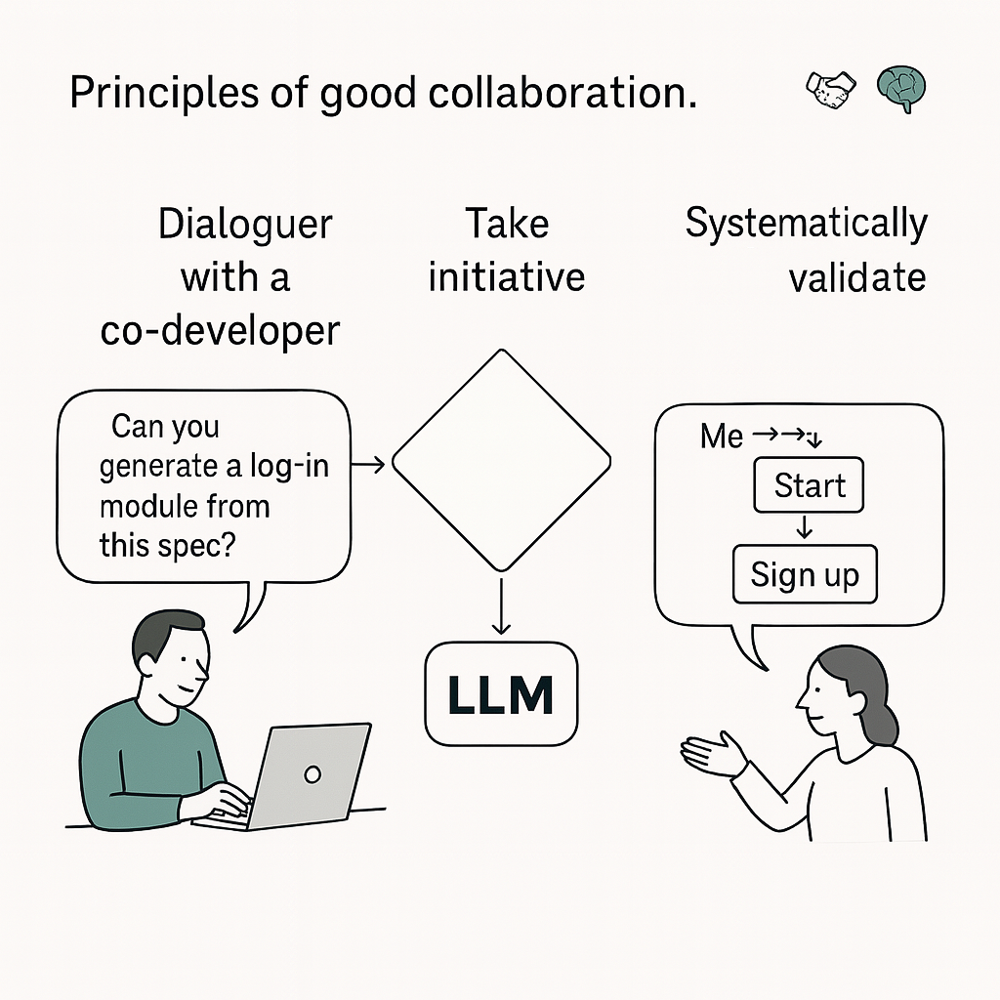

---

## 🧠 Chapter 2 — The Grammar of Intention: Thinking and Framing with an LLM

> *An LLM doesn’t “understand.” It completes. It doesn’t infer a true reasoning but a plausible sequence. It’s up to us, humans, to make it a valid partner — by framing the exchange, structuring it, inhabiting it.*

Designing with an LLM isn’t about giving orders. It’s about building a dialogue. And like any dialogue, it has implicit rules, codes, and friction points.

In this chapter we propose a **grammar of interaction**: a set of gestures, reflexes, and postures that make dialogue with an LLM productive. It isn’t a syntax to memorize, but a way of thinking: **thinking in interaction**.

---

### 🎼 The LLM as a Naïve Partner

Picture a design session with a colleague who is ultra-competent but:

* knows nothing about your exact context,
* has only partial memory of the exchange,
* sometimes responds brilliantly, sometimes off-target,
* and never dares to say “I don’t know.”

That’s what working with an LLM is like. You have to create the conditions for a useful exchange: structure, contextualize, iterate.

> *The LLM knows everything, but nothing about you.
> It’s fast, but forgetful.
> Creative, but naïve.
> Not reliable by default — it becomes so through collaboration.*

---

### 🎯 The Five Fundamental Gestures of the Grammar of Intention

#### 1. **Frame (always re-contextualize)**

An LLM has neither long-term memory nor knowledge of your project. You must inject the **functional, technical, and business context** into each interaction.

> *“I’m working on a banking app in Java; my goal is to secure API calls for transactions.”*

#### 2. **Ask One Thing at a Time**

An LLM performs best with single, unitary requests. One intention per prompt. If you ask three questions at once, it will answer the one it understands best — not necessarily the most important.

> ✅ *“Can you break this task down into technical steps?”*
> ❌ *“Give me code + documentation + edge cases.”*

#### 3. **Rephrase (validate and clarify)**

After each response, check for coherence. Rephrase what you understood. Ask for justifications. This creates an iterative dialogue.

> *“If I understand correctly, you’re suggesting a service-oriented architecture. What weaknesses do you see in that approach?”*

#### 4. **Synthesize (consolidate decisions)**

An LLM has no implicit continuity. It won’t retain what was said earlier unless you restate it. Summarize the decisions, hypotheses, and directions at each key step.

> *“Let’s recap the system constraints we set: performance, fault tolerance, low cost. Can you re-evaluate the architecture choices in light of these criteria?”*

#### 5. **Test (put the answer to the test)**

Don’t take the model’s answer as truth. Ask it to consider counter-examples, limits, edge cases. This refines the solution — or reveals its flaws.

> *“In what case could this solution fail?”*
> *“What if the graph contains negative cycles?”*

---

### 🔎 Use Case: Reframing to Think Better

A team is working on a stock management module. They use an LLM to choose between a monolithic and a microservices architecture.
The initial prompt — *“Which architecture should we choose?”* — generates a generic answer.
By injecting specific constraints (team size, deployment frequency, need for horizontal scalability), the answer becomes sharper. The LLM turns into a **simulator of options**, and the dialogue a way to explore possibilities.

---

### 🛠 Active Grammar — Example Workshop

Another team uses an LLM as an **ideation facilitator** during a workshop. Each participant asks the model a question. The answer is discussed collectively, then rephrased. Some prompts become shared work objects; others are refined in group. The AI hasn’t replaced discussion: it has catalyzed it.

---

### 🧭 Summary: The Five Reflexes of Good Interaction

| Gesture           | Guiding Question                         |
| ----------------- | ---------------------------------------- |
| **Frame**         | In what context am I?                    |
| **Ask One Thing** | Am I asking a single, clear question?    |
| **Rephrase**      | Am I checking what the model understood? |
| **Synthesize**    | Am I stabilizing what’s been decided?    |
| **Test**          | Which limits haven’t been explored?      |

    

---

> *The grammar of intention isn’t a fixed method. It’s an art of interacting, adjusting, building meaning in nuance.*

Understanding this grammar lays the foundation for effective dialogue. It teaches you not to delegate reasoning but to distribute it. In short, it makes the LLM a **smart co-pilot**, not an oracle to follow blindly.
