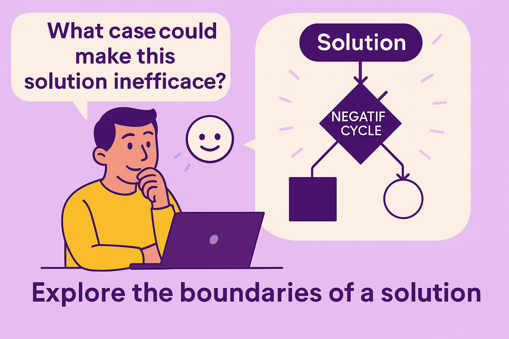

---

### 🟣 Pattern 5 — **Clarification by Counterexample**: *Probe the Limits of a Proposal*

    

**🎯 Context**
The LLM has produced a satisfactory answer — code, a technical solution, a recommendation. Everything looks fine… but a nagging doubt remains. Is it really robust? Does the answer cover all cases? Does the reasoning hold up at the edges?

**🚧 Problem**
The model often produces an “ideal” or typical solution that **hides edge cases or failure modes**. The developer may be tempted to trust it by default. Yet without putting it to the test, you risk deploying a fragile, biased, or naïve solution.

**✅ Solution**
Question the answer **by negation**: ask for a **counterexample**, a situation where the solution fails, becomes inefficient, or produces an unexpected effect. This reveals the **implicit limits** of the reasoning and sharpens your understanding of what the solution does — and doesn’t — cover.

> Example prompts:
>
> * “In what case could this solution fail?”
> * “Can you propose an example of data that would cause a problem?”
> * “What if the file is empty? If the connection fails? If the user isn’t authenticated?”
> * “Which implicit assumption, if false, would make this solution invalid?”

**📌 Consequences**

* Early detection of edge cases.
* Greater robustness of the proposed solution.
* Fosters a critical mindset in the developer.
* Reduces side effects or surprises in production.
* Enriches the initial prompt if needed (see Pattern 6).

**💡 Example Use**
A student asks the LLM to implement Dijkstra’s algorithm in JavaScript.
The solution looks correct. He follows up with:

> *“What if the graph contains negative cycles?”*

The LLM replies:

> *“Dijkstra isn’t suited for that case. You’d need Bellman–Ford, which handles negative weights.”*

This simple follow-up turns a generation session into a **moment of algorithmic learning**, by making an invisible assumption visible.

#### **🌀 Useful Variants**

* **Boundary Test**: “What if the array is empty? If a value is null?”
* **Stress Test**: “What if 10,000 users access this module at the same time?”
* **Business Counter-Rule**: “What business situation would invalidate this rule?”
* **Simulated Debate**: “Can you simulate the opinion of a developer who criticizes this solution?”

**🛠️ Associated Tools**

* Acceptance-test tables enriched by the model.
* Combined use with test-data generation (see Pattern 3).
* Augmented pairing: a developer plays devil’s advocate with the LLM.

**🧠 Recommended Posture**
Don’t be satisfied with the “apparently good” answer. Adopt a **scientific posture**: falsify, test, push the logic to its edges. This is how the LLM becomes a **critical partner**, not a flattering automaton.

**💬 Prompt to Remember**

> *“Give a case that would make this solution fail. What does that reveal about its limits?”*
