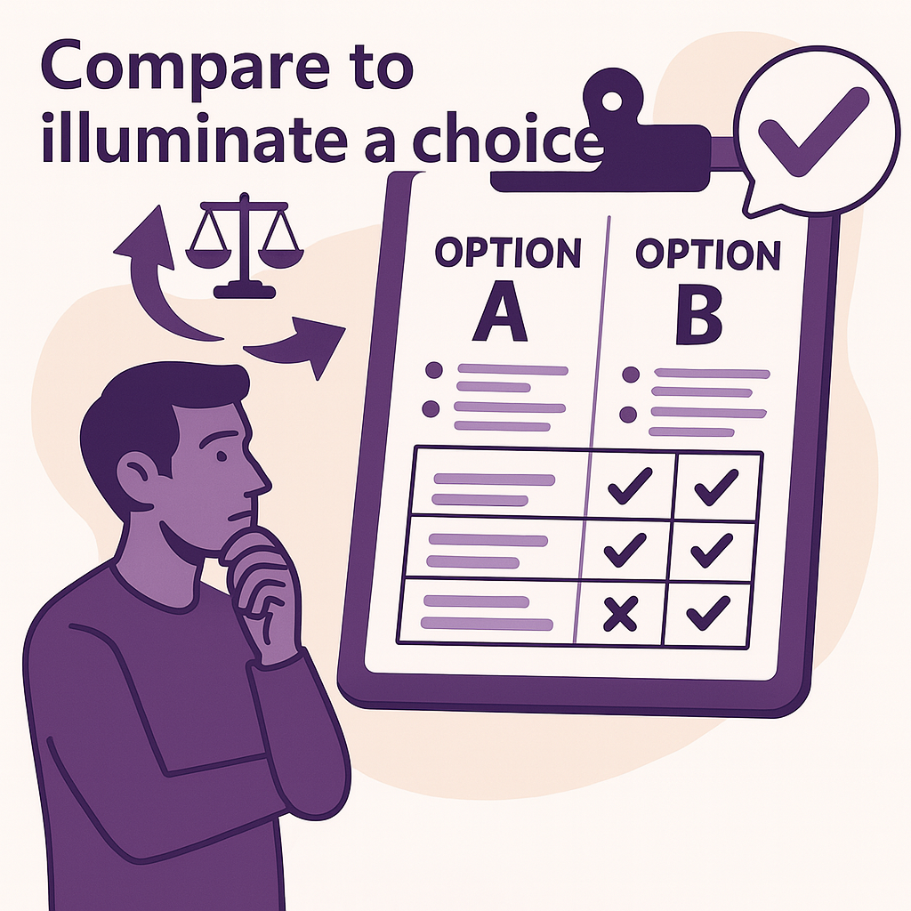

---

### 🟣 Pattern 4 — **Mirror Model**: *Compare to Clarify a Choice*

    

**🎯 Context**
You’re hesitating between several possible solutions: two architectures, two algorithmic approaches, two coding styles, two tools. The team is discussing, but the debate stays vague or biased. You need to step back and decide *consciously* — not by reflex or personal preference.

**🚧 Problem**
By default, an LLM often replies with *a single solution*. Yet in complex situations it’s more useful to **compare several options** than to get one “typical answer.” Without confronting alternatives, you risk sticking with the first good-sounding proposal… and missing the consequences.

**✅ Solution**
Use the LLM as a **comparative mirror**: explicitly ask it to produce several variants of a solution, then to compare them according to defined criteria (readability, performance, maintainability, UX…). This turns the answer into a **dialectical analysis** that illuminates the decision.

> Example prompts:
>
> * “Provide two implementations of this function — one imperative, one functional — and compare them.”
> * “Give three architecture options and their pros/cons given our constraints.”
> * “Compare React and Svelte for this type of project.”

**📌 Consequences**

* Promotes critical analysis instead of mimicry.
* Makes the choice criteria explicit.
* Supports collective decision-making, especially in a team context.
* Reduces confirmation or authority bias.
* Serves as a basis for documenting decisions.

**💡 Example Use**
In a payment-system redesign project, the team is hesitating between:

1. An event-driven architecture with Kafka
2. A more classic synchronous REST architecture

The prompt becomes:

> *“Compare these two options for a high-availability system handling 100 transactions per second. What are the trade-offs?”*

The LLM highlights that:

* Kafka is more resilient but harder to monitor,
* REST is simpler to test but less robust to load spikes.

The discussion then draws on these elements to make an **argued decision**, not simply “because we’ve always done it that way.”

#### **🌀 Useful Variants**

* **Style Mirror**: compare imperative vs functional style, object-oriented vs declarative.
* **Paradigm Mirror**: polling vs event-driven, synchronous vs asynchronous.
* **Tool Mirror**: front-end frameworks, database engines, testing libraries, etc.
* **UX Mirror**: compare two error messages, two user journeys.

**🛠️ Associated Tools**

* A comparison grid co-built with the LLM.
* A two-dimensional table: options × criteria.
* Possible integration into an Architecture Decision Record (ADR) doc.

**🧠 Recommended Posture**
Ask for *several options* before diving into just one. Make the LLM a **stimulator of reasoned divergence**. It won’t decide for you — it will light the way.

**💬 Prompt to Remember**

> *“Propose several alternatives for this need, then compare them according to these criteria: \[X, Y, Z].”*
