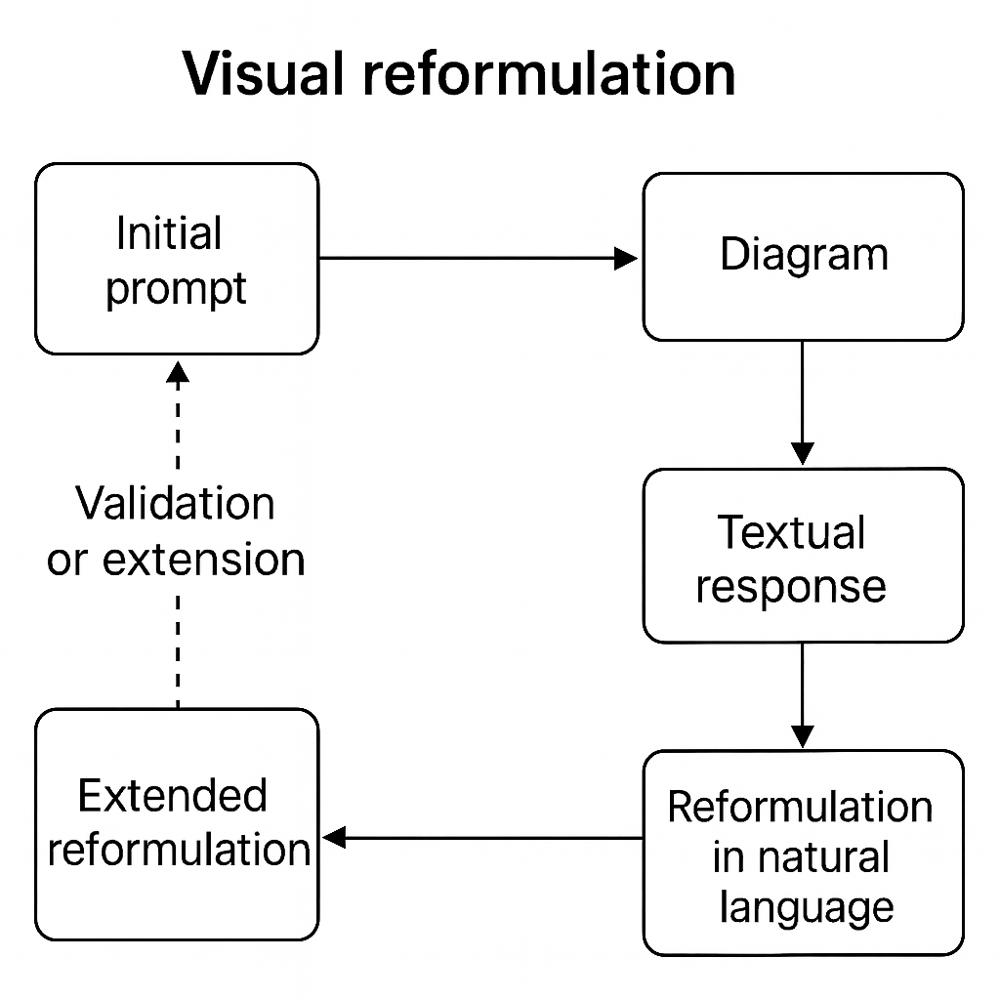

---

### 🟣 Pattern 7 — **Visual Reformulation**: *Clarify Through Representation*

    

**🎯 Context**
The LLM proposes a textual solution: an architecture, an algorithm, a process, a code organization. The answer is interesting but dense or ambiguous. You suspect missing links, fuzzy parts, or inconsistencies hidden in the linearity of the text.

**🚧 Problem**
Natural language sometimes hides **shadow zones**: logical shortcuts, ill-defined interfaces, missing modules, implicit steps… The solution seems complete but it’s **not structurally verified**. Without visualization, you risk naïve acceptance or a shaky implementation.

**✅ Solution**
Turn the LLM’s textual proposal into a **visual diagram**: component diagram, flow, structured table, mind map, etc. Then **reformulate that diagram in natural language** and submit it back to the model for validation, critique, or enrichment.

> Example loop:
>
> 1. Initial request → LLM textual response
> 2. Manual visualization (draw\.io, table, mind map…)
> 3. Structured textual reformulation of what you understood
> 4. New prompt to the LLM: “Here’s my understanding. Is it consistent? What’s missing?”

**📌 Consequences**

* Surfaces **logical inconsistencies** earlier.
* Eases collective validation within the team.
* Promotes better **human appropriation** of the solution.
* Stimulates a reflective exchange between human and AI.
* Develops a key skill: **modeling to understand**.

**💡 Example Use**
The LLM proposes an architecture for a multichannel notification system. A developer turns it into a component diagram:

* alert manager
* prioritization module
* queue
* webhook/email sends
* Redis for caching

They reformulate:

> *“If I understand correctly, the alert arrives in a manager, which classifies it, stores it, then transmits it. Redis serves as cache. Is that right? What should be added?”*

The LLM answers:

> *“You’re missing a failure-handling mechanism. You could add a retry queue with logging.”*

This reformulation loop **strengthens the robustness** of the solution.

#### **🌀 Useful Variants**

* **Two-way table**: roles × responsibilities, modules × dependencies.
* **Lightweight UML**: class, sequence, activity diagrams.
* **Mind map**: useful for exploring features or flows.
* **Hand-drawn sketch + transcription**: draw on paper, then ask the LLM to express it in words.

**🛠️ Associated Tools**

* Modeling tools (draw\.io, Whimsical, Excalidraw…).
* Schema integrated into following prompts: *“Here’s a diagram, describe it as if you had proposed it.”*
* Team rituals: architecture validation augmented by sketching + AI.

**🧠 Recommended Posture**
Don’t stay in textual blur. Go through **visualization to clarify, validate, and enrich**. Drawing or structured layout is itself a **form of dialogue** — with yourself, with others, with the model.

**💬 Prompt to Remember**

> *“Here’s a textual reformulation of my diagram. Can you check whether it’s consistent with your initial proposal and suggest improvements?”*
