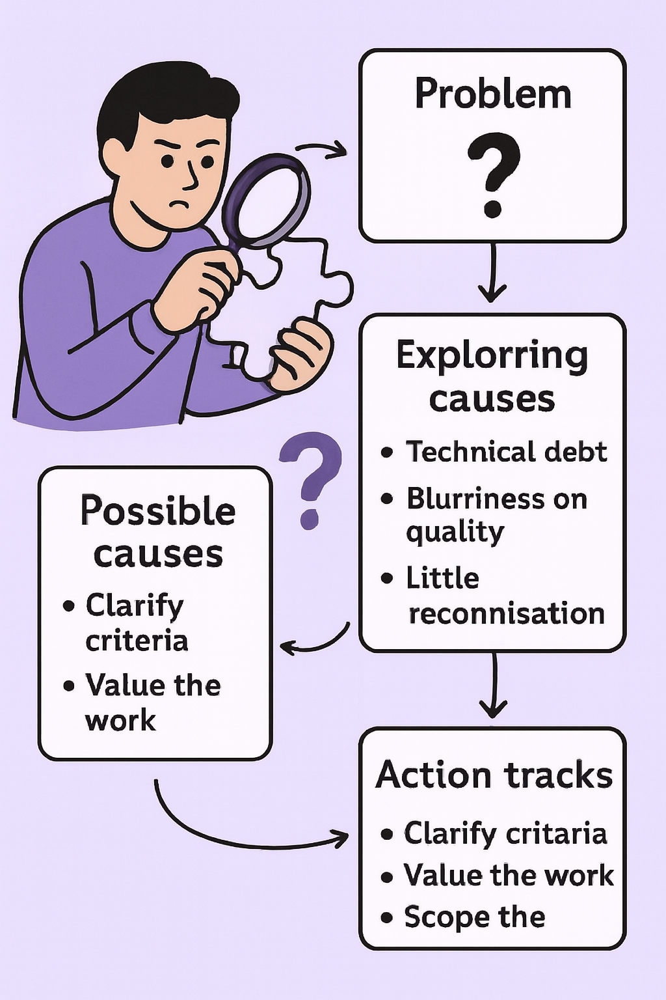

---

### 🟣 Pattern 8 — **Systemic Care**: *Investigate the Root Causes of a Problem*

    

**🎯 Context**
A problem persists in a project or a team. It might be a recurring bug, latent demotivation, accumulated delay, or interpersonal tension. It’s not just an isolated technical or organizational defect: **something is stuck at a deeper level**, but without an obvious cause.

**🚧 Problem**
The reflex is often to look for a quick, local, technical fix. But by stopping at the visible symptom, you risk **missing the real causes** — often multiple, intertwined, systemic. If poorly prompted, the LLM will propose patches rather than a structured diagnosis.

**✅ Solution**
Mobilize the LLM as a **partner in systemic investigation**. Don’t ask it for a direct solution, but **help it help you dig**:

* explore the possible causes of a problem,
* cross perspectives (technical, human, organizational),
* propose targeted courses of action consistent with the actual cause.

> Example prompts:
>
> * “Here’s a recurring problem in the team. What possible causes do you see — technical, relational, process?”
> * “Can you guide me through a 5 Whys / 9 Whys session to explore the root?”
> * “Propose a logical tree of causes and sub-causes.”

> 🧭 **The Nine Whys: Dig for Meaning to Act Better**
>
> Inspired by **Liberating Structures**, the *Nine Whys* canvas offers a simple yet powerful ritual: ask nine times in a row **“Why is this important to you?”** starting from a given subject.
>
> Far from being an interrogation, it’s a **path of progressive clarification**, where each answer becomes the basis of the next question. You’re not looking for a single cause, but a **depth of meaning**: what truly motivates action, underpins choices, or matters deeply.
>
> In software development, this tool becomes precious when:
>
> * a decision seems obvious but provokes fuzziness or resistance,
> * a recurring technical problem hides human or systemic tensions,
> * a team wants to align its efforts on what really matters.
>
> 👉 The LLM can play a role here as a **questioning facilitator**: by proposing follow-up formulations, structuring answers, or surfacing implicit contradictions.
>
> > Example prompts:
> >
> > *“Can you help me simulate a Nine Whys session on this problem: \[describe situation]?”*
> > *“At each answer, propose a reformulation of ‘Why is it important?’ shifting the angle slightly (values, impact, emotion, system…).”*

**📌 Consequences**

* Enables a **shared diagnosis** before acting.
* Prevents premature or misdirected action.
* Fosters collective intelligence and reflexivity.
* Creates solutions more anchored in reality.
* Brings lucidity where agitation often reigns.

**💡 Example Use**
A team feels a **diffuse demotivation** around a critical module.
Initial prompt:

> *“How can we motivate the team again?”*

Responses: a bit generic (celebrate wins, change environment…).
The Scrum Master reframes:

> *“Why this demotivation, in your view? Can you explore several possible causes, crossing technical, human, and organizational dimensions?”*

The LLM proposes:

* anxiety-inducing technical debt,
* fuzziness on quality criteria,
* lack of recognition of efforts.

The team digs into these causes one by one and comes up with **three concrete actions**: clarify quality rules, create a recognition ritual, launch a framed progressive refactoring.

#### **🌀 Useful Variants**

* **Cause Tree**: a branching diagram of causes/symptoms.
* **Multi-Perspective**: ask the LLM to analyze the situation from the viewpoint of a dev, a PO, a manager.
* **Contradictory Hypotheses**: push the model to generate different explanations for the same symptom.

> Prompt example:
> *“Give me three opposing hypotheses about the probable causes of this situation.”*

**🛠️ Associated Tools**

* Systemic-analysis models (5 Whys, 9 Whys, Ishikawa, causal-loop diagrams).
* Shared inquiry canvases with the LLM as questioning facilitator.
* Sprint reviews augmented by root-cause exploration (see Chapter 8).

**🧠 Recommended Posture**
Resist rushing. Take time to **understand before acting**. Use the AI not as an oracle but as a **co-investigator of systems**. This requires listening, nuance, and the capacity to let non-technical causes emerge in a mostly technical world.

**💬 Prompt to Remember**

> *“Here’s a problem that keeps coming up. Can you help me explore its root causes from several angles without immediately proposing a solution?”*
