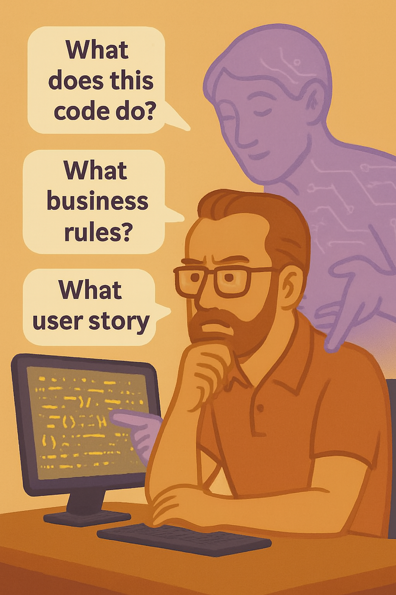

---

### 🟣 Pattern 3 — **Reverse Specification**: *Surface Intentions from Code*

    

**🎯 Context**
You need to understand existing code — often old, poorly documented, or written by someone else. You’re arriving *after* the design. There are no user stories, no clear documentation, no explicit intent. Yet you have to refactor, audit, test, or explain this code.

**🚧 Problem**
The code shows you *how* something is done but not *why*. Without the original intentions, business constraints, or implicit assumptions, you’re forced to guess. That makes the task long, risky, and frustrating.

**✅ Solution**
Use the LLM as a **retroactive intention detector**. Feed it portions of code and ask it to:

* reformulate the implicit functional intentions,
* make the business rules explicit,
* suggest the probable user stories,
* identify the assumptions or presuppositions of the original developer.

> Example prompts:
>
> * “What does this code do?”
> * “What business rules does this seem to implement?”
> * “What user story could correspond to this block of code?”
> * “What implicit assumptions about data or context does this code seem to make?”

**📌 Consequences**

* Shortens the analysis of unknown code.
* Produces **retroactive documentation**.
* Surfaces biases or blind spots.
* Serves as a support for code review, handover, or refactoring.
* Reconnects code with business logic, implementation with intention.

**💡 Example Use**
During an audit, a team inherits an 800-line PHP module with no tests and no documentation.
Instead of reading it line by line, they split the file into logical blocks and use this prompt:

> *“What business rules does this block seem to implement?”*

The LLM detects:

* Duplicate detection,
* VAT control,
* Conditional rounding,
* Special cases not mentioned in the doc.

This iterative work lets them reconstruct the original intentions, document use cases, and plan a refactor without breaking everything.

#### **🌀 Useful Variants**

* **Reconstructing User Stories**

Instead of only asking *what the code does*, push the LLM to reformulate the intentions in *user-centric functional terms*. Prompt example:

> *“Assuming this code corresponds to a product feature, what user story could we infer from it?”*

**Use**: handy in projects where code was produced before formalizing requirements (often prototypes or hackathon phases).

* **Inferring Implicit Assumptions**

Ask the LLM:

> *“What implicit assumptions does this code seem to make about data, execution contexts, or access rights?”*

**Use**: valuable to detect implicit biases, input presuppositions, or security blind spots.

* **Implicit Interface Contract**

Ask the LLM:

> *“Can you make explicit an interface contract for this function/module (input types, outputs, handled errors)?”*

**Use**: helps produce *Design by Contract* retroactively or document APIs without initial docs.

**🛠️ Associated Tools**

* Integration into IDE via augmented-analysis plug-in.
* Prompt routine for code review (see Chapter 9).
* Documentation generated from source code, enriched by an LLM.

**🧠 Recommended Posture**
The LLM doesn’t replace your own reading of the code — it **guides** it. Use its suggestions as **working hypotheses**, not as truth. Cross-check with your intuition, existing tests, and business feedback.

**💬 Prompt to Remember**

> *“Here’s an undocumented function. Can you explain what it does, why, and what assumptions it seems to make?”*
