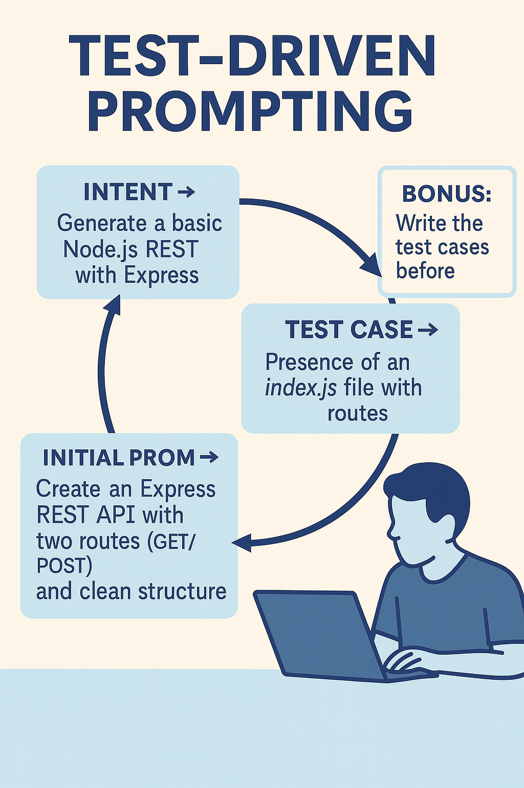

---

### 🟣 Pattern 6 — **Test-Driven Prompting (TDP)**: *Define Expectations Before Writing*

    

**🎯 Context**
You want to design a prompt you can reuse, share, or integrate into a tool. But the LLM’s outputs are too variable — sometimes off-topic, sometimes excellent — and you don’t know why. Stabilizing the usage becomes difficult.

**🚧 Problem**
The prompt is written intuitively, without a clear frame. Expectations aren’t spelled out. As a result, the model improvises, and its answers are **inconsistent**. You correct after the fact instead of steering production upfront.

**✅ Solution**
Adopt an approach inspired by **Test-Driven Development (TDD)**:
before writing the prompt, **define the expectations** the answer must meet. This can include:

* concrete examples of the expected output (mock output),
* criteria for structure, style, or content,
* explicit constraints on format, tone, or length.

Then **write the prompt so that it satisfies these criteria**. Test it. Refine it. You design the prompt **as a functional unit to validate**.

> Example pre-criteria:
>
> * “The answer must fit in fewer than 3 sentences.”
> * “Use an empathetic but professional tone.”
> * “Never mention legal disclaimers.”
> * “Begin by rephrasing the customer’s request.”

**📌 Consequences**

* Your prompts become **precise, stable, and reusable**.
* You save time over the long term.
* You can share tested prompts within a team or tool.
* You turn the prompt into a genuine **engineering artifact**.
* You detect the limits of what the LLM can or cannot do well.

**💡 Example Use**
A team is creating a conversational assistant to reply to customer tickets.
Initial prompt:

> *“Write an empathetic reply to the customer.”*

Result: too long, too vague, sometimes legally risky.
They decide to set these expectations **upfront**:

* 2 to 3 sentences max
* No legal disclaimers
* Reassure without promising
* Adapt language level to the identified customer

They then adjust the prompt until it **produces responses that pass these tests**. The prompt is versioned, shared, and integrated into a tool.

#### **🌀 Useful Variants**

* **Visual TDP**: create an example of expected output and ask the model to “match this example.”
* **Collaborative TDP**: have several roles (PO, UX, support, tech) define the expectations together.
* **Embedded TDP**: include the test criteria *inside the prompt itself*:

  > *“The answer must be no longer than 3 sentences, remain neutral, and end with an open question.”*

**🛠️ Associated Tools**

* Library of versioned prompts (Markdown or Notion).
* Test files (example prompts + expected outputs).
* Semi-automated evaluation of responses (scoring against defined criteria).

**🧠 Recommended Posture**
Design your prompts **like code**: testable, maintainable, evolvable. Don’t settle for a prompt that “works once”: aim for robustness. This makes your practices more professional, shareable, and reliable.

**💬 Prompt to Remember**

> *“Here’s an example of the expected response. Can you formulate a prompt that produces this kind of output consistently?”*
