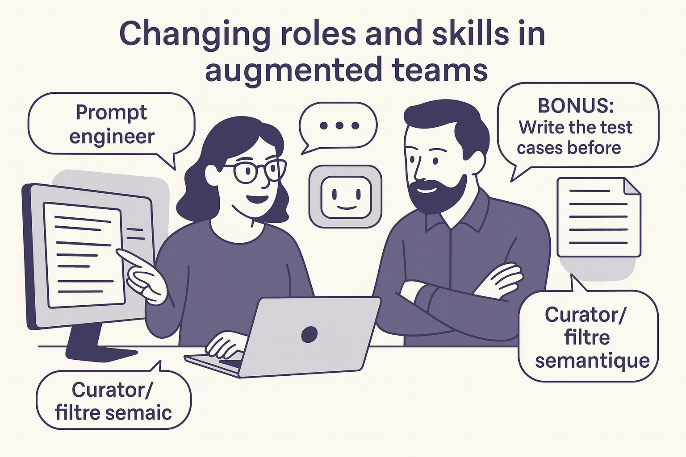

---

## 👥 Chapter 4 — New Roles, New Skills: The Evolution of Augmented Teams

    

> Designing with an LLM may not just be a tooling question. It could represent a deeper shift in how roles are carried out, redefined… or continuously adapted.

---

### 📌 Why This Chapter?

We’ve seen how to interact effectively with an LLM (Ch. 2–3) and how to structure those interactions as patterns (Ch. 4). It now makes sense to ask what this new practice changes in team life.

A few questions naturally arise:

* Are **new roles** actually appearing?
* Which **skills are becoming more important**, even if not brand new?
* Are **traditional roles** changing in nature, or only in how they’re expressed?

These questions aren’t meant to give a final answer but to **open a space for observation**. Transformations are still unfolding — often silently, sometimes invisibly in job grids. This chapter maps some early lines of force.

---

### 🧭 Two Lenses of Analysis

#### **Functional Roles**

These are the formal roles within a team — developer, PO, tech lead, coach, etc. They belong to an explicit, observable organization.

#### **Conversational Postures**

These are the ways of interacting with the LLM: asking questions, filtering, reformulating, exploring… They’re more diffuse but just as decisive in an augmented environment.

> The two dimensions aren’t mutually exclusive. A developer may successively adopt the posture of **designer**, **curator**, **hypothesis tester** — depending on timing, context, and intent.

---

### 🔄 Transformation of Existing Roles

Here’s one (evolving) way to read the shifts we’ve observed:

| Role                  | Possible Evolutions With LLM Use                           |
|-----------------------| ------------------------------------------------------------------- |
| **Developer**         | From code producer to **designer of structured dialogues**      |
| **Tech Lead**         | Becomes the guardian of meaning in hybrid reasoning chains    |
| **PO / PM**           | Gains autonomy in formulating business hypotheses     |
| **UX / UI**           | Explores variants or journey ideas quickly      |
| **Agile Coach** | Introduces AI into reflective practices or retrospectives  |
| **Tester / QA**      | Generates and evaluates test sets from specs or prompts  |
| **Trainer**         | Uses the LLM as a dialogue simulator or case-study base |

> These evolutions aren’t automatic. They depend heavily on context, team culture, individual interest. Adoption remains uneven and experimental.

---

#### The Augmented Developer: Orchestrating Reasoning

The modern developer no longer codes solely from personal knowledge but mobilizes a repertoire of interactions with models that can complete, reformulate, propose, synthesize. This shift calls for a new posture:

* **Anticipating prompt clarity** as a skill in its own right.
* **Detecting biases, logical gaps, or overgeneralizations** in responses.
* **Becoming the guarantor of intelligibility** of the system for future humans (themselves, the team, auditors, users).

This implies:

* **Mastering the ambiguity of natural language**,
* **Taking a critical eye to automatic suggestions**,
* Knowing how to **transform raw results into understandable, documented, maintainable artifacts**.

This editorial posture isn’t entirely new — but it’s taking a **more central place** in an augmented environment.

> **The Developer–Editor**
>
> A seasoned developer recently told me: *“I feel more like an editor than a writer. The AI proposes; I choose, cut, reformulate, structure.”*
> This parallel with editorial work captures the new nature of software production: it’s no longer linear, but interactive, critical, narrative.

---

### 🧪 Emerging Postures in Dialogue With the LLM

These postures are often **cross-cutting across roles**. They can coexist, combine, evolve.

#### 🎯 The **Prompt Designer**

* Masters formulation subtleties.
* Builds templates, sequences, intent tests.
* Optimizes for clarity, robustness, transferability.

#### 🔎 The **Curator / Semantic Filter**

* Reads, corrects, cleans, validates LLM responses.
* Distinguishes signal from noise, detects hallucinations.
* Structures good ideas for integration.

#### 🧠 The **Explorer of Possibilities**

* Requests variants, alternative scenarios.
* Plays with counterexamples, mirrors, limit tests.
* Uses the LLM to “think sideways” and broaden the field.

#### 📚 The **Augmented Documentalist**

* Generates summaries, guides, onboarding packs.
* Organizes knowledge produced by the LLM.
* Capitalizes on and shares effective prompts.

#### 🧰 The **Pattern Designer**

* Observes recurring usage.
* Formalizes patterns to transmit them.
* Contributes to the culture of the augmented team.

#### 🌿 The **Holistic Caregiver**

* Seeks to understand root causes beyond symptoms.
* Uses the LLM as a partner in systemic investigation: Nine Whys, cause trees, multiple hypotheses.
* Develops targeted action paths based on root causes, considering human, technical, and organizational interactions.
* Adopts a posture of listening, slow questioning, linking weak signals.

---

### 🧩 Cross-Cutting Skills to Strengthen

Some skills are becoming transversal to all technical roles:

| Skill                         | Why It Becomes Critical With an LLM          |
| ----------------------------- | -------------------------------------------- |
| **Clear Formulation**         | Condition for any effective interaction      |
| **Technical Critical Sense**  | To avoid blindly following responses         |
| **Exploratory Curiosity**     | To make use of unexpected suggestions        |
| **Capacity to Synthesize**    | To consolidate decisions from dialogue       |
| **Ethics of Use**             | To frame bias, risks, documentation          |
| **Transmission of Practices** | To keep patterns alive, capitalize and share |

These skills can be learned, observed, cultivated. They probably deserve greater recognition.

---

### 🧪 Field Illustrations

#### 🔁 Augmented Pairing

In an application-redesign project, a junior and a senior developer work as a pair with an LLM. The junior plays the **prompt-writer** role, proposing ideas. The senior filters, restructures, adds context. The LLM becomes a **third silent partner** — sometimes inspiring, sometimes fragile. Together they co-design modules that are documented, tested, and discussed.

#### 🧭 Augmented Retrospective

In a development team, the Scrum Master proposes using an LLM as co-facilitator of the retrospective. Team members state sprint irritants or successes; the model proposes groupings, reflection axes, even action paths. The Scrum Master’s role shifts: they no longer centralize ideas but orchestrate a triangular interaction between human voices and AI synthesis. This experiment reveals new required skills: critical re-reading, live adaptation, dialogue-flow design.

---

### 🎓 Toward New Roles?

Some emerging roles are starting to appear in organizations:

* **Prompt Designer**
* **AI Facilitator**
* **Cognitive Architect**
* **Curator of Generated Knowledge**

These roles are still marginal. They also raise questions: **Do we need to name what can remain diffuse?**
Perhaps it’s less about adding new job titles and more about **recognizing emerging skills where they already occur**, often invisibly.

---

### ✏️ An Open Synthesis

* LLMs **don’t impose new roles**, but make **new postures** possible.
* Teams would benefit from **observing how they’re appropriating these tools**, in their own way.
* The point is less to formalize a new org chart than to **create space to explore, name, and transmit** what’s changing in everyday gestures.

> Dialogue between humans and AI isn’t fixed. It’s negotiated, cultivated, learned. That’s perhaps where the heart of tomorrow’s skills lies.

> A good dialogue with an LLM is like good software design: clear, modular, iterative… and profoundly human.
